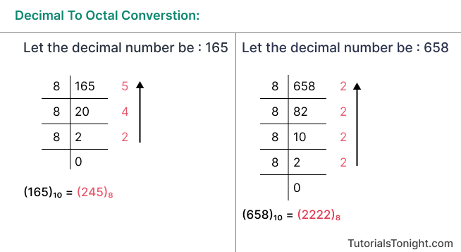
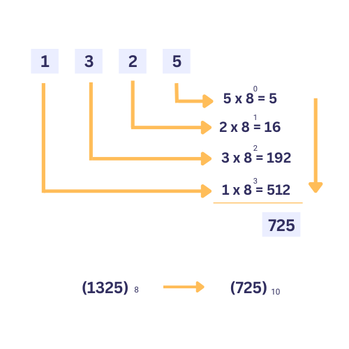
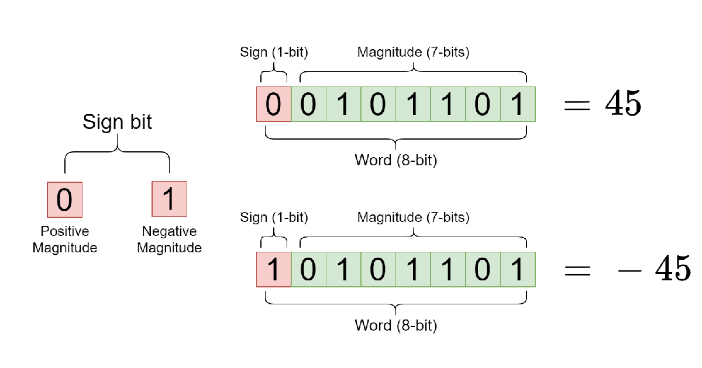
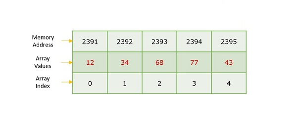

<body>
  <H1>Daily Learning</H1>
<div>
<h2>Basic</h2>
<p>
Day-1 (Date: 7-4-2023)
<h3>Why Binary not Decimal</h3>
<p>
  Computers use binary numbers instead of decimal numbers because binary is well-suited for electronic systems and digital processing. Here are a few reasons why binary is preferred over decimal in computer systems:

1. Simplicity of representation: Binary numbers consist of only two digits, 0 and 1, which aligns well with the on/off states of electronic switches (transistors). This simplicity makes it easier to design and implement digital circuits.

2. Hardware compatibility: The internal components of computers, such as logic gates and memory cells, are designed to work with binary signals. Using binary allows for direct compatibility and seamless integration with the underlying electronic hardware.

3. Reliability and noise resistance: Binary signals are more robust against noise and interference. The distinction between the binary digits 0 and 1 is easier to maintain in electronic circuits, reducing the chances of errors due to signal distortion.

4. Efficiency in storage: Binary numbers require fewer bits to represent the same value compared to decimal numbers. This efficiency in storage is crucial for memory and storage devices, as it allows for more information to be stored using the same amount of physical resources.

5. Logical operations: Binary numbers lend themselves well to logical operations like AND, OR, and NOT. These operations form the basis of computational operations in computers. Using binary simplifies the design and implementation of logical circuits and arithmetic units.

Although decimal numbers are more intuitive for human comprehension, they are not as efficient or compatible with the underlying electronic components and operations performed within computers. Binary numbers, while requiring a mental shift for human users, provide a highly efficient and reliable system for representing and manipulating information in computer systems.
</p>

  <h4>Number System</h4>
  <pre>
    1.Binary - Two base number.
    2.Octal - Eight base number.
    2.Decimal - Ten base number.
    2.Hexadecimal - Sixteen base number.
  </pre>
  <div>
    <h4>Binary to Decimal</h4>
    <pre>
      
      </br>
function convertToDecimal(x) {
    let bin = 0;
    let rem, i = 1, step = 1;
    while (x != 0) {
        rem = x % 10;
        x = parseInt(x / 10);
        bin = bin + rem * i;
        i = i * 2;
    }
console.log(`Decimal:  ${bin}`);
}
// take input
//let number = prompt('Enter a Binary number: ');
convertToDecimal(101);
    </pre>
    <h4>Decimal to Binary</h4>
    <pre>
      

</br>

Other way - decimal 75
75 >= 64 = 1
75 - 64 = 11

 32 >= 11 = 0
 16 >= 11 = 0

11 >= 8 = 1
11 - 8 = 3

3 >= 2 = 1
3 - 2 = 0

1 >= 1 = 1

64 = 1 
32 = 0 
16 = 0 
8 = 1 
4 = 0 
2 = 1 
1 = 1

75 = 1001011

function convertToBinary(x) {
    let bin = 0;
    let rem, i = 1, step = 1;
    while (x != 0) {
        rem = x % 2;
        console.log(
            `Step ${step++}: ${x}/2, Remainder = ${rem}, Quotient = ${parseInt(x/2)}`
        );
        x = parseInt(x / 2);
        bin = bin + rem * i;
        i = i * 10;
    }
    console.log(`Binary:  ${bin}`);
}
// take input
//let number = prompt('Enter a decimal number: ');
convertToBinary(5);
    </pre>
  </div>

  <h4>Decimal to Octal</h4>
  <pre>
    
    </br>
function convertToCOtalTOdecimal(x) {
    let bin = 0;
    let rem, i = 1, step = 1;
    while (x != 0) {
        rem = x % 8;
        x = parseInt(x / 8);
        bin = bin + rem * i;
        i = i * 10;    
    }
console.log(`Octal:  ${bin}`);
}
// take input
//let number = prompt('Enter a Decimal number: ');
convertToCOtalTOdecimal(8);

  </pre>
  <h4>Octal to Decimal</h4>
  <pre>
    
    </br>
function convertToDecimalTOOCatal(x) {
    let bin = 0;
    let rem, i = 1, step = 1;
    while (x != 0) {
        rem = x % 10;
        x = parseInt(x / 10);
        bin = bin + rem * i;
        i = i * 8;    
    }
    console.log(`Decimal:  ${bin}`);
}
// take input
//let number = prompt('Enter a Octal number: ');

convertToDecimalTOOCatal(100);
  </pre>
  
  <h4>DIFFERENT BETWEEM INTERPRETER AND COMPILAR</h4>
  A compiler translates the entire source code in a single run. 
  An interpreter translates the entire source code line by line

  <div>
  <h3>#KEYWORDS</h3>
    
    1. High level Language > INTERPRETER(Work line by line) > Machine Language
    2. Assembly language > Assembler > Machine Language
    3. Mid level language ( C )
    4. High level language(python, c++, c# etc)
    5. compiler(GNU, CSS) - A compiler translates the entire source code in a single run
    6. CodeBlocks(IDE-Integrated Development Environment)
    
  </div>
<div>
  <h1>Learn About Compiler and C/C++ </h1>
  <h4>Day-2 (Date: 7-6-2023)</h4>
  <p>Watch some videos read some documents about how compiler works</p>

  <a href="Book-Files/COMPUTER-PROGRAMMING-TAMIM-SHAHRIAR-SHUBEEN.pdf">Book(Bangla) - COMPUTER PROGRAMMING TAMIM SHAHRIAR SHUBEEN (Language C)</a> 
  </br>
  <a href="Book-Files/Programming in C - Stephen G.Cochan.pdf">Book(English) - PROGRAMMING IN C - STEPHEN G.COCHAN (Language C)</a>
  
  <h4>MEMORY</h4>
  <pre>
    Int (32bit) = {
      2 byte = 2 x 8 bit
             = 16 bit 
    }
    Int(64bit) = {
      4 byte = 4 x 8 bit
             = 32 bit 
    }
    32 bit maximum number = 2^n - 1
                          = 2^31 - 1                    
  <h4>HOW TO STORE NEGATIVE AND POSITIVE NUMBER IN MEMORY</h4>
    #Sign bit
    0 -> Positive
    1 -> Negative
    MSB = Most Significant Bit
    LSB = Most Significant Bit
    
    In this case in magnitude area first number is MSB and last number is LSB.
    <h4>PROBLEM OF SIGN BIT</h4>
    0 0 0 0 !== 1 0 0 0
    +0 !== -0
    #SOLVE
    0011 = +3
    => 1100(flip of 0011) = 1's complement
    1's complement + 1
    1100 + 1 = 1101 = -2 (2's complement)
    0010 + 1 = +3 (2's complement) 
    #In this case computer can store 4bit.
    1111 + 1 = 10000 
    so, answer = 0000 = -0
    <h3>#KEYWORDS</h3>
    CodeBlocks,Environment setup,terminal,GCC,cmd 
  </pre>
</div>
<div>
  <h1>Bit Manipulaion</h1>
  <h4>Day-2 (Date: 7-5-2023)</h4>
  <pre>
    Bit manipulation is a technique used in computer programming to manipulate individual bits within a binary representation of data. It involves        
    performing logical and arithmetic operations at the bit level, allowing developers to perform various tasks efficiently and compactly. Here are some 
    commonly used bit manipulation operations:

      1. Bitwise AND (&): Performs a logical AND operation on each corresponding pair of bits. 
      The result is 1 if both bits are 1; otherwise, it is 0.

        Example:
        ```
        10101010 &
        11001100
        ---------
        10001000
        ```

      3. Bitwise OR (|): Performs a logical OR operation on each corresponding pair of bits. 
      The result is 1 if either of the bits is 1; otherwise, it is 0.

        Example:
        ```
        10101010 |
        11001100
        ---------
        11101110
        ```

      4. Bitwise XOR (^): Performs a logical XOR (exclusive OR) operation on each corresponding pair of bits. 
      The result is 1 if the bits are different; otherwise, it is 0.

        Example:
        ```
        10101010 ^
        11001100
        ---------
        01100110
        ```

      5. Bitwise NOT (~): Flips the bits of a binary number. The result is the one's complement of the number.

        Example:
        ```
        ~10101010
        ---------
        01010101
        ```

      6. Bitwise left shift (<<): Shifts the bits of a number to the left by a specified number of positions. 
      This operation effectively multiplies the number by 2 raised to the power of the shift amount.

        Example:
        ```
        10101010 << 2
        -------------
        1010101000
        ```

      7. Bitwise right shift (>>): Shifts the bits of a number to the right by a specified number of positions. 
      This operation effectively divides the number by 2 raised to the power of the shift amount.

        Example:
        ```
        10101010 >> 2
        -------------
        00101010
        ```

    Bit manipulation is often used in various applications, such as optimizing code, implementing data structures, 
    and working with low-level operations like device drivers, network protocols, and cryptography algorithms. 
    It allows for compact representation of data and efficient bitwise operations that can significantly improve 
    performance in certain scenarios.
    
    #Example of bit off or on test
      let x,y,z;
      x = parseInt(prompt("Inter number ", y));
      bit = parseInt(prompt("Inter bit number ", z));
      
      if(x & (1 << bit)){
        console.log(`${bit} nd bit is ON`);
      }else{
        console.log(`${bit} nd bit is OFF`);
      }    
  </pre>
</div>

<div>
  <h1>IF ELSE LOOP</h1>
  <h4>Day-3 (Date: 7-8-2023)</h4>
  <h3>IF ELSE</h3>
  <pre>
    if (test expression) {
      // run code if test expression is true
    }
    else if(test expression){
      // run code if test expression is true
    }
    else {
      // run code if test expression is false
    }
  </pre>
  <h3>FOR</h3>
  <pre>
    for (initializationStatement; testExpression; updateStatement){
    // statements inside the body of loop
    }
  </pre>
  <h3>WHILE</h3>
  <pre>
    while(condition) {
      statement(s);
   }
  </pre>
  <h3>DO-WHILE</h3>
  <pre>
    do {
      // the body of the loop
    }
    while (testExpression);
  </pre>
</div>

<div>
  <h1>NESTED LOOP</h1>
  <h4>Day-4 (Date: 7-9-2023)</h4>
  <h3>Left Triangle Pattern </h3>
  <pre>
    
    *
    * *
    * * *

    #js
    let n=3
    let string = "";
    for(let l = 0; l < n; l++){
      for(let i = 0; i <= l ; i++){
        string += "* "
      }
      string += "\n"; 
    }
    console.log(string);

    #C

    #include <stdio.h>

      int main() {
      int n=3;
      
      for(int l = 0; l < n; l++){
          for(int i = 0;i <= l; i++){
              printf("* ");
          }
          printf("\n");
        }
        return 0;
      }
  </pre>
  <h3>Reverse Left Triangle Pattern</h3>
  <pre>

    * * *
    * *
    *

    #JS 
    let n = 3;
    let string = "";
    for (let i = n; i >= 1; i--) {
      for (let j = 0; j < i; j++) {
        string += "* ";
      }
      string += "\n";
    }
    console.log(string);

    #C
    #include <stdio.h>
      int main() {
      int n=3;
      
      for(int l = n; l >= 1; l--){
          for(int i = 0;i < l; i++){
            printf("* ");
          }
          printf("\n");
        }
        return 0;
      }
  </pre>
  <h3>Right Triangle Pattern</h3>
  <pre>

    * * *
      * *
        *

    #JS 
    let n = 3;
    let string = "";
    for (let i = 0; i < n; i++) {
      for (let j = 0; j < i; j++) {
        string += " ";
      }
      for (let x = 0; x < n-i; x++) {
        string += "*";
      }
      string += "\n";
    }
    console.log(string);

    #C
    #include <stdio.h>
      int main() {
      int n=3;
      for(int l = 0; l < n; l++){
          for(int i = 0;i < l; i++){
            printf(" ");
          }
          for(int star = 0; star < n-l; star++){
              printf("*");
          }
          printf("\n");
        }
        return 0;
      }
  </pre>
</div>

<div>
  <h1>Switch-Statement and Array</h1>
  <h4>Day-4 (Date: 7-11-2023)</h4>
  <h3>Structure</h3>
  <pre>
    switch(variable){
      case value 1;
      //statement
      break;
      case value 2;
      //statement
      break;

      #Example
      console.log("1.User login\n 2.User list\n 3.Sign up\n");
      let op;
      let answer = parseInt(prompt("which option to choese? ", op));

      switch(answer){
          case 1:
              console.log("User login successful\n");
              break;
          case 2:
              console.log("User list shown\n");
              break;
          case 3:
              console.log("Sign up done\n");
              break;
          default:
              console.log("Inter number 1 to 3\n");
      }
    }
  </pre>
  <h3>Array</h3>
  In computer programming, an array is a data structure that stores a fixed-size sequence of elements of the same type. 
  It is a collection of variables, each identified by an index or a key, that can be accessed individually. 
  The elements in an array are typically stored in contiguous memory locations, which allows for efficient access and manipulation of the data.

  Arrays are commonly used to store collections of related data, such as a list of numbers, strings, or objects. 
  The index of an array starts from zero, so the first element is accessed using index 0, the second element with index 1, and so on.
  
  Arrays can be one-dimensional, two-dimensional, or multi-dimensional depending on the number of indices needed to access the elements. 
  A one-dimensional array is like a simple list, while a two-dimensional array is like a table with rows and columns. 
  Multi-dimensional arrays can have more than two dimensions and are used to represent complex data structures.
  
  Arrays provide an efficient way to store and retrieve large amounts of data and are a fundamental concept in many programming languages. 
  They offer benefits such as random access to elements, constant time access (assuming the index is known), and support for various operations 
  like sorting, searching, and iterating over the elements.
  <br>
  Data type array name[size] = [Elements]

  
  <pre>
    #Example of input array
    #include <stdio.h>
     
      int main() {
        printf("Input array index: ");
        int i=0, n;

        scanf("%d", &n);
        int ara[n];

        printf("Input array: ");

        for(int idx = 0; idx < n; idx++){
          scanf("%d", &ara[idx]);
        }
        printf("Displaying integers: ");

        for(int idx = 0; idx < n; idx++){
          printf("%d,", ara[idx]);
        } 
        return 0;
      }
  </pre>
  <h3>Brace Initializer</h3>
  The brace initializer, also known as initializer list syntax, is a way to initialize the elements of an array in many programming languages, 
  including C++, Java, and JavaScript. It allows you to provide a list of values enclosed in braces { }, which are used to populate the array with the    
  specified values.
  <br>
  Here's an example in C++:
  <pre>
    int myArray[] = {1, 2, 3, 4, 5};
  </pre>

  In this example, we declare an integer array called `myArray` and initialize it with the values 1, 2, 3, 4, and 5 using the brace initializer. 
  The number of elements in the array is determined by the number of values provided within the braces.
  The brace initializer can also be used for multi-dimensional arrays. 
  <br>
  Here's an example of a 2D array:

  <pre>
    int myArray2D[][3] = {{1, 2, 3}, {4, 5, 6}};
  </pre>
  In this case, we declare a 2D integer array called `myArray2D` with two rows and three columns. We use the brace initializer to provide the values for each row. 
  The inner braces are used to specify the values for each row, and the outer braces encompass the entire initializer list.
  
  The brace initializer syntax can be handy when you want to quickly initialize an array with a known set of values. 
  It eliminates the need for individual assignments to each element of the array and provides a concise and readable way to 
  initialize the array elements directly within the declaration statement.

  # If you specify the value for the array index it will replace the garbage value into 0.
  #Example
  <pre>
    #include <stdio.h>
     
      int main() {
        int ara[10]= {1,2,3,4,5};
        int value = sizeof(ara)/ sizeof(ara[0]);
        
        printf("Displaying integers: ");
        for(int idx = 0; idx < value; idx++){
          printf("%d ", ara[idx]);
        } 
        return 0;
      }

  Or use memset,

  #include <stdio.h>
    #include <cstring>
    
     int main() {
       printf("Input array index: ");
       int MXN = 100;
       int ara[MXN];
       
       memset(ara, 0, sizeof ara);
       
       printf("Displaying integers: ");
       for(int i = 0; i < MXN; i++){
          printf("%d ", ara[i]);
       } 
       
       return 0;
     }

     #note memsent works on three value.
     1. memset(arrayName, 0, sizeof arrayName);
     2. memset(arrayName, -1, sizeof arrayName);
     3. memset(arrayName, 0x3f3f3f3f, sizeof arrayName); (Infinity Number = 0x3f3f3f3f);

  </pre> 
  <h3>Memeset Library</h3>
  The `memset` function is a standard C library function that is used to set a block of memory with a specified value. 
  It takes three arguments: a pointer to the memory block, the value to be set, and the number of bytes to set.

  The `memset` function works well when you need to set memory blocks with values such as 0 or -1. 
  However, it may not work as expected when you try to set memory blocks with values other than 0 or -1.

  The reason for this limitation is that `memset` operates on a byte level and sets each byte of the memory block to the specified value. 
  If the desired value is not representable in a single byte, the behavior of `memset` becomes undefined.
  For example, consider setting a memory block with the value 255 (0xFF) using `memset`:
  <pre>
    int myArray[10];
    memset(myArray, 255, sizeof(myArray));
  </pre>
  In this case, since the value 255 cannot be represented by a single byte, `memset` will set each byte of the memory block to 255 independently. 
  This can result in unexpected behavior, as the resulting value in each element of `myArray` may not be 255.

  To initialize an array with a specific value other than 0 or -1, you can use a loop to individually set each element of the array to the desired value. 
  Alternatively, you can use language-specific features or library functions that provide array initialization mechanisms, 
  such as brace initialization in C++ or `Arrays.fill()` method in Java, to achieve the desired result reliably.
</div>

</p>
</div>
</body>
</html>
