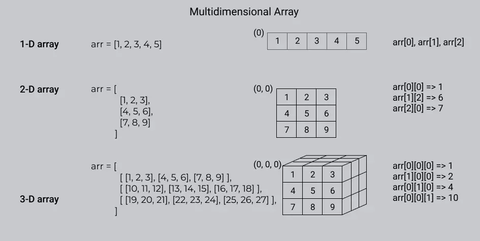

# Daily Learning
## Basic
#### Day-1 (Date: 7-4-2023)
### Before You Start
In this documentation there are three kind of programming language C, C++, JS. but the concept are same. If know any programming language you are good to go.

if you don't know any programming language yet learn the basic first:
- <a href="Book-Files/COMPUTER-PROGRAMMING-TAMIM-SHAHRIAR-SHUBEEN.pdf" target="_blank">Book(Bangla) - COMPUTER PROGRAMMING TAMIM SHAHRIAR SHUBEEN (Language C)</a>

- <a href="Book-Files/Programming in C - Stephen G.Cochan.pdf" target="_blank">Book(English) - PROGRAMMING IN C - STEPHEN G.COCHAN (Language C)</a>

### Why Binary not Decimal
 Computers use binary numbers instead of decimal numbers because binary is well-suited for electronic systems and digital processing. Here are a few reasons why binary is preferred over decimal in computer systems:

1. Simplicity of representation: Binary numbers consist of only two digits, 0 and 1, which aligns well with the on/off states of electronic switches (transistors). This simplicity makes it easier to design and implement digital circuits.

2. Hardware compatibility: The internal components of computers, such as logic gates and memory cells, are designed to work with binary signals. Using binary allows for direct compatibility and seamless integration with the underlying electronic hardware.

3. Reliability and noise resistance: Binary signals are more robust against noise and interference. The distinction between the binary digits 0 and 1 is easier to maintain in electronic circuits, reducing the chances of errors due to signal distortion.

4. Efficiency in storage: Binary numbers require fewer bits to represent the same value compared to decimal numbers. This efficiency in storage is crucial for memory and storage devices, as it allows for more information to be stored using the same amount of physical resources.

5. Logical operations: Binary numbers lend themselves well to logical operations like AND, OR, and NOT. These operations form the basis of computational operations in computers. Using binary simplifies the design and implementation of logical circuits and arithmetic units.

Although decimal numbers are more intuitive for human comprehension, they are not as efficient or compatible with the underlying electronic components and operations performed within computers. Binary numbers, while requiring a mental shift for human users, provide a highly efficient and reliable system for representing and manipulating information in computer systems.

### Number System

    1.Binary - Two base number.
    2.Octal - Eight base number.
    2.Decimal - Ten base number.
    2.Hexadecimal - Sixteen base number.

### Binary to Decimal


```javascript
function convertToDecimal(x) {
    let bin = 0;
    let rem, i = 1, step = 1;
    while (x != 0) {
        rem = x % 10;
        x = parseInt(x / 10);
        bin = bin + rem * i;
        i = i * 2;
    }
console.log(`Decimal:  ${bin}`);
}
// take input
//let number = prompt('Enter a Binary number: ');
convertToDecimal(101);
```
### Decimal to Binary


    Other way - decimal 75
    75 >= 64 = 1
    (75 - 64 = 11)

    32 >= 11 = 0
    (32 - 11 = 11)
    16 >= 11 = 0

    11 >= 8 = 1
    (11 - 8 = 3)
    
    4 >= 3 = 0
    3 >= 2 = 1
    (3 - 2 = 1)

    1 >= 1 = 1

    64 = 1
    32 = 0
    16 = 0
    8 = 1
    4 = 0
    2 = 1
    1 = 1

    75 = 1001011

```javascript
function convertToBinary(x) {
    let bin = 0;
    let rem, i = 1, step = 1;
    while (x != 0) {
        rem = x % 2;
        console.log(
            `Step ${step++}: ${x}/2, Remainder = ${rem}, Quotient = ${parseInt(x/2)}`
        );
        x = parseInt(x / 2);
        bin = bin + rem * i;
        i = i * 10;
    }
    console.log(`Binary:  ${bin}`);
}
// take input
//let number = prompt('Enter a decimal number: ');
convertToBinary(5);
```
### Decimal to Octal


```javascript
function convertToCOtalTOdecimal(x) {
    let bin = 0;
    let rem, i = 1, step = 1;
    while (x != 0) {
        rem = x % 8;
        x = parseInt(x / 8);
        bin = bin + rem * i;
        i = i * 10;
    }
console.log(`Octal:  ${bin}`);
}
// take input
//let number = prompt('Enter a Decimal number: ');
convertToCOtalTOdecimal(8);
```
### Octal to Decimal


```javascript
function convertToDecimalTOOCatal(x) {
    let bin = 0;
    let rem, i = 1, step = 1;
    while (x != 0) {
        rem = x % 10;
        x = parseInt(x / 10);
        bin = bin + rem * i;
        i = i * 8;
    }
    console.log(`Decimal:  ${bin}`);
}
// take input
//let number = prompt('Enter a Octal number: ');

convertToDecimalTOOCatal(100);
```
### DIFFERENT BETWEEM INTERPRETER AND COMPILAR
  A compiler translates the entire source code in a single run.
  An interpreter translates the entire source code line by line

  > ## KEYWORDS

    1. High level Language > INTERPRETER(Work line by line) > Machine Language
    2. Assembly language > Assembler > Machine Language
    3. Mid level language ( C )
    4. High level language(python, c++, c# etc)
    5. compiler(GNU, CSS) - A compiler translates the entire source code in a single run
    6. CodeBlocks(IDE-Integrated Development Environment)

---
# Learn About Compiler and C/C++
#### Day-2 (Date: 7-6-2023)
Watch some videos read some documents about how compiler works

### MEMORY

    Int (32bit) = {
      2 byte = 2 x 8 bit
             = 16 bit
    }
    Int(64bit) = {
      4 byte = 4 x 8 bit
             = 32 bit
    }
    32 bit maximum number = 2^n - 1
                          = 2^31 - 1

## HOW TO STORE NEGATIVE AND POSITIVE NUMBER IN MEMORY
### Sign bit
    0 -> Positive
    1 -> Negative
    MSB = Most Significant Bit
    LSB = least Significant Bit

In this case in magnitude area first number is MSB and last number is LSB.
### PROBLEM OF SIGN BIT
    0 0 0 0 !== 1 0 0 0
    +0 !== -0
### SOLVE
    0011 = +3
    => 1100(flip of 0011) = 1's complement
    1's complement + 1
    1100 + 1 = 1101 = -2 (2's complement)
    0010 + 1 = +3 (2's complement)
### In this case computer can store 4bit.
    1111 + 1 = 10000
    So, answer = 0000 = -0

> ## KEYWORDS
    CodeBlocks,Environment setup,terminal,GCC,cmd

# Bit Manipulaion
#### Day-2 (Date: 7-5-2023)
Bit manipulation is a technique used in computer programming to manipulate individual bits within a binary representation of data. It involves performing logical and arithmetic operations at the bit level, allowing developers to perform various tasks efficiently and compactly. Here are some commonly used bit manipulation operations:

1. Bitwise AND (&): Performs a logical AND operation on each corresponding pair of bits. The result is 1 if both bits are 1; otherwise, it is 0.

        Example:
        ```
        10101010 &
        11001100
        ---------
        10001000
        ```

3. Bitwise OR (|): Performs a logical OR operation on each corresponding pair of bits. The result is 1 if either of the bits is 1; otherwise, it is 0.

        Example:
        ```
        10101010 |
        11001100
        ---------
        11101110
        ```

4. Bitwise XOR (^): Performs a logical XOR (exclusive OR) operation on each corresponding pair of bits. The result is 1 if the bits are different; otherwise, it is 0.

        Example:
        ```
        10101010 ^
        11001100
        ---------
        01100110
        ```

5. Bitwise NOT (~): Flips the bits of a binary number. The result is the one's complement of the number.

        Example:
        ```
        ~10101010
        ---------
        01010101
        ```

6. Bitwise left shift (<<): Shifts the bits of a number to the left by a specified number of positions. This operation effectively multiplies the number by 2 raised to the power of the shift amount.

        Example:
        ```
        10101010 << 2
        -------------
        1010101000
        ```

7. Bitwise right shift (>>): Shifts the bits of a number to the right by a specified number of positions. This operation effectively divides the number by 2 raised to the power of the shift amount.

        Example:
        ```
        10101010 >> 2
        -------------
        00101010
        ```

Bit manipulation is often used in various applications, such as optimizing code, implementing data structures, and working with low-level operations like device drivers, network protocols, and cryptography algorithms. It allows for compact representation of data and efficient bitwise operations that can significantly improve performance in certain scenarios.

### Example of bit off or on test
```C
let x,y,z;
x = parseInt(prompt("Inter number ", y));
bit = parseInt(prompt("Inter bit number ", z));

if(x & (1 << bit)){
  console.log(`${bit} nd bit is ON`);
}else{
  console.log(`${bit} nd bit is OFF`);
}
```

# IF ELSE LOOP
#### Day-3 (Date: 7-8-2023)
### IF ELSE
```C
if (test expression) {
  // run code if test expression is true
}
else if(test expression){
  // run code if test expression is true
}
else {
  // run code if test expression is false
}
```
### FOR

```c
for (initializationStatement; testExpression; updateStatement){
  // statements inside the body of loop
}
```
### WHILE
```C
while(condition) {
  statement(s);
}
```
### DO-WHILE
```C
do {
  // the body of the loop
}
while (testExpression);
```

# NESTED LOOP
#### Day-4 (Date: 7-9-2023)
### Left Triangle Pattern


    *
    * *
    * * *

>js
```javascript
let n=3
let string = "";
for(let l = 0; l < n; l++){
  for(let i = 0; i <= l ; i++){
    string += "* "
  }
  string += "\n";
}
console.log(string);
```
>C
```C
#include <stdio.h>
  int main() {
  int n=3;

  for(int l = 0; l < n; l++){
    for(int i = 0;i <= l; i++){
      printf("* ");
    }
    printf("\n");
  }
  return 0;
}
```
### Reverse Left Triangle Pattern

    * * *
    * *
    *

>JS
```javascript
let n = 3;
let string = "";
for (let i = n; i >= 1; i--) {
  for (let j = 0; j < i; j++) {
    string += "* ";
  }
  string += "\n";
}
console.log(string);
```
>C

```C
#include <stdio.h>
int main() {
int n=3;

for(int l = n; l >= 1; l--){
    for(int i = 0;i < l; i++){
      printf("* ");
    }
    printf("\n");
  }
  return 0;
}
```
### Right Triangle Pattern

    * * *
      * *
        *

>JS
   
```javascript
let n = 3;
let string = "";
for (let i = 0; i < n; i++) {
  for (let j = 0; j < i; j++) {
    string += " ";
  }
  for (let x = 0; x < n-i; x++) {
    string += "*";
  }
  string += "\n";
}
console.log(string);
```
>C
```C
#include <stdio.h>
int main() {
int n=3;
for(int l = 0; l < n; l++){
    for(int i = 0;i < l; i++){
      printf(" ");
    }
    for(int star = 0; star < n-l; star++){
        printf("*");
    }
    printf("\n");
  }
  return 0;
}
```

# SWITCH-STATEMENT AND ARRAY
#### Day-4 (Date: 7-11-2023)
### STRUCTURE

```C
switch(variable){
    case value 1;
    //statement
    break;
    case value 2;
    //statement
    break;

    #Example
    console.log("1.User login\n 2.User list\n 3.Sign up\n");
    let op;
    let answer = parseInt(prompt("which option to choese? ", op));

    switch(answer){
        case 1:
            console.log("User login successful\n");
            break;
        case 2:
            console.log("User list shown\n");
            break;
        case 3:
            console.log("Sign up done\n");
            break;
        default:
            console.log("Inter number 1 to 3\n");
    }
  }
```

### ARRAY
In computer programming, an array is a data structure that stores a fixed-size sequence of elements of the same type. It is a collection of variables, each identified by an index or a key, that can be accessed individually. The elements in an array are typically stored in contiguous memory locations, which allows for efficient access and manipulation of the data.
Arrays are commonly used to store collections of related data, such as a list of numbers, strings, or objects. The index of an array starts from zero, so the first element is accessed using index 0, the second element with index 1, and so on.
Arrays can be one-dimensional, two-dimensional, or multi-dimensional depending on the number of indices needed to access the elements. A one-dimensional array is like a simple list, while a two-dimensional array is like a table with rows and columns. Multi-dimensional arrays can have more than two dimensions and are used to represent complex data structures.
Arrays provide an efficient way to store and retrieve large amounts of data and are a fundamental concept in many programming languages. They offer benefits such as random access to elements, constant time access (assuming the index is known), and support for various operations like sorting, searching, and iterating over the elements.

    Data type array name[size] = [Elements]


#### Example of input array

```C
#include <stdio.h>

int main() {
  printf("Input array index: ");
  int i=0, n;

  scanf("%d", &n);
  int ara[n];

  printf("Input array: ");

  for(int idx = 0; idx < n; idx++){
    scanf("%d", &ara[idx]);
  }
  printf("Displaying integers: ");

  for(int idx = 0; idx < n; idx++){
    printf("%d,", ara[idx]);
  }
  return 0;
}
```
### Brace Initializer
The brace initializer, also known as initializer list syntax, is a way to initialize the elements of an array in many programming languages, including C++, Java, and JavaScript. It allows you to provide a list of values enclosed in braces { }, which are used to populate the array with the specified values.

#### Here's an example in C++:
    int myArray[] = {1, 2, 3, 4, 5};


In this example, we declare an integer array called `myArray` and initialize it with the values 1, 2, 3, 4, and 5 using the brace initializer. The number of elements in the array is determined by the number of values provided within the braces. The brace initializer can also be used for multi-dimensional arrays.

#### Here's an example of a 2D array:
    int myArray2D[][3] = {{1, 2, 3}, {4, 5, 6}};

In this case, we declare a 2D integer array called `myArray2D` with two rows and three columns. We use the brace initializer to provide the values for each row. The inner braces are used to specify the values for each row, and the outer braces encompass the entire initializer list.

The brace initializer syntax can be handy when you want to quickly initialize an array with a known set of values. It eliminates the need for individual assignments to each element of the array and provides a concise and readable way to initialize the array elements directly within the declaration statement.

### If you specify the value for the array index it will replace the garbage value into 0.
#### Example

```C
#include <stdio.h>

int main() {
  int ara[10]= {1,2,3,4,5};
  int value = sizeof(ara)/ sizeof(ara[0]);

  printf("Displaying integers: ");
  for(int idx = 0; idx < value; idx++){
    printf("%d ", ara[idx]);
  }
  return 0;
}

// Or use memset,

#include <stdio.h>
#include <cstring>

int main() {
 printf("Input array index: ");
 int MXN = 100;
 int ara[MXN] = {1,2,3,4,5};

 printf("Displaying integers: ");
 for(int i = 0; i < MXN; i++){
    printf("%d ", ara[i]);
 }
 memset(ara, 0, sizeof ara);
 return 0;
}
```


### Note memsent works on three value.
     
    1. memset(arrayName, 0, sizeof arrayName);
    2. memset(arrayName, -1, sizeof arrayName);
    3. memset(arrayName, 0x3f3f3f3f, sizeof arrayName); (Infinity Number = 0x3f3f3f3f);

### Memeset Library
The `memset` function is a standard C library function that is used to set a block of memory with a specified value. It takes three arguments: a pointer to the memory block, the value to be set, and the number of bytes to set.

The `memset` function works well when you need to set memory blocks with values such as 0 or -1. However, it may not work as expected when you try to set memory blocks with values other than 0 or -1.

The reason for this limitation is that `memset` operates on a byte level and sets each byte of the memory block to the specified value. If the desired value is not representable in a single byte, the behavior of `memset` becomes undefined.

For example, consider setting a memory block with the value 255 (0xFF) using `memset`:
```C
int myArray[10];
memset(myArray, 255, sizeof(myArray));
```
In this case, since the value 255 cannot be represented by a single byte, `memset` will set each byte of the memory block to 255 independently. This can result in unexpected behavior, as the resulting value in each element of `myArray` may not be 255.

To initialize an array with a specific value other than 0 or -1, you can use a loop to individually set each element of the array to the desired value. Alternatively, you can use language-specific features or library functions that provide array initialization mechanisms, such as brace initialization in C++ or `Arrays.fill()` method in Java, to achieve the desired result reliably.

### ARRAY COMPRESSION
The term "array compression" might be less commonly used, but it can refer to a technique where you represent an array using less memory by exploiting patterns or repetitions in the data. This concept is also known as "run-length encoding."

Run-length encoding is a simple form of data compression, where consecutive occurrences of the same value in an array are replaced with a single value and the number of repetitions. This can significantly reduce the memory usage for arrays with repetitive elements.

Here's a basic explanation and example of array compression (run-length encoding) in C:

```c
#include <stdio.h>

// Function to perform array compression (run-length encoding)
// Input: src - the input array to be compressed
//        n - the size of the input array
//        dest - the output compressed array
// Returns: the size of the compressed array
int compressArray(int src[], int n, int dest[]) {
    int compressedIndex = 0;
    int i = 0;

    while (i < n) {
        int currentElement = src[i];
        int count = 1;

        // Count the number of consecutive occurrences of the current element
        while ((i + 1 < n) && (src[i + 1] == currentElement)) {
            count++;
            i++;
        }

        // Store the compressed value and its count in the destination array
        dest[compressedIndex++] = currentElement;
        dest[compressedIndex++] = count;

        i++; // Move to the next element in the source array
    }

    return compressedIndex; // Return the size of the compressed array
}

int main() {
    int originalArray[] = {1, 1, 1, 2, 2, 3, 3, 3, 3, 3, 4, 5, 5, 5};
    int n = sizeof(originalArray) / sizeof(originalArray[0]);

    // The destination array for the compressed data
    int compressedArray[2 * n]; // The compressed array can be at most twice the size of the original array

    // Compress the original array
    int compressedSize = compressArray(originalArray, n, compressedArray);

    // Print the compressed array
    printf("Compressed Array: ");
    for (int i = 0; i < compressedSize; i += 2) {
        printf("(%d, %d) ", compressedArray[i], compressedArray[i + 1]);
    }
    printf("\n");

    return 0;
}
```

In this example, the `compressArray` function takes an input array `src`, its size `n`, and an output array `dest` to store the compressed data. The function iterates through the input array, counts consecutive occurrences of each element, and writes the compressed data (element, count) to the destination array. The main function demonstrates how to use the `compressArray` function.

Keep in mind that array compression is not always beneficial, and its effectiveness depends on the nature of the data. For some arrays, compression can lead to a smaller memory footprint, but for others, it might increase the memory usage due to additional metadata for representing the counts.

### MAP ARRAY
In C, the term "array map" is not a standard language feature or a commonly used concept. However, it might refer to a technique or operation applied to each element of an array to transform its values into new values based on a specific function or mapping rule.

The process of applying a function to each element of an array to generate a new array of transformed elements is often called "array mapping" or "element-wise mapping." It is a common operation in many programming languages, including C.

Here's a simple explanation of array mapping in C:

Suppose you have an array of integers, and you want to create a new array where each element is the square of the corresponding element from the original array. In this case, you can use array mapping to achieve this transformation.

```c
#include <stdio.h>

// Function to perform array mapping (element-wise mapping)
// Input: src - the input array
//        n - the size of the input array
//        dest - the output mapped array
void mapArray(int src[], int n, int dest[]) {
    for (int i = 0; i < n; i++) {
        dest[i] = src[i] * src[i]; // Square each element
    }
}

int main() {
    int originalArray[] = {1, 2, 3, 4, 5};
    int n = sizeof(originalArray) / sizeof(originalArray[0]);

    // The destination array for the mapped data
    int mappedArray[n];

    // Map the original array to create the mapped array
    mapArray(originalArray, n, mappedArray);

    // Print the mapped array
    printf("Mapped Array: ");
    for (int i = 0; i < n; i++) {
        printf("%d ", mappedArray[i]);
    }
    printf("\n");

    return 0;
}
```

In this example, the `mapArray` function takes an input array `src`, its size `n`, and an output array `dest`. It iterates through the input array, applies the mapping function (in this case, squaring each element), and stores the transformed elements in the destination array.

Please note that "array mapping" is not a standard term in C, but it's commonly used to describe this kind of element-wise transformation on arrays. The operation can vary depending on the mapping function used and the desired transformation.

<a href="https://developer.mozilla.org/en-US/docs/Web/JavaScript/Reference/Global_Objects/Array" target ="_blank">Learn More About Array<a>

# PRECISION LOSS
#### Day-5 (Date: 7-12-2023)
Precision loss in programming refers to the loss of precision or accuracy in numerical calculations due to limitations in the representation of numbers in computer systems. Computers use finite binary representations to store and manipulate numbers, which can lead to rounding errors and loss of precision.

One common example of precision loss is observed when working with floating-point numbers. Floating-point numbers are represented as a combination of a sign, a significand or mantissa, and an exponent. However, the binary representation of floating-point numbers cannot precisely represent all decimal numbers. As a result, operations involving floating-point numbers may introduce small errors due to rounding or truncation.

For example, consider the following code snippet in Python:
```Python
x = 0.1
y = 0.2
z = x + y
print(z)
```
The expected result of this addition operation would be 0.3. However, due to precision loss in floating-point arithmetic, the actual result may be slightly different, such as 0.30000000000000004. This small discrepancy is a result of the limited precision of the binary representation used to store the numbers.

Precision loss can also occur in other areas of programming, such as when performing calculations involving large numbers or when working with algorithms that involve multiple operations. The cumulative effect of these small errors can lead to significant discrepancies in the final results.

To mitigate precision loss, programming languages and libraries provide various techniques and functions for handling numerical computations with improved precision. For instance, some programming languages offer decimal data types that provide arbitrary precision arithmetic, allowing calculations with high precision at the cost of increased memory usage and computational overhead.

It is important for programmers to be aware of precision loss and consider it when designing algorithms or performing critical calculations where accuracy is crucial. Additionally, understanding the limitations and properties of different data types and their representations can help minimize precision loss in programming.

 ### HOW TO PREVENT PRECISION LOSS
```C
#include <stdio.h>
int main() {
  const double eps = 1e-6;
  double a,b, sum;
  a = 2.99999999999;
  b = 3.00000000001;

  sum = a-b;
  if(sum < eps){
      printf("a and b are same");
  }
  return 0;
}
```
### INSERT IN ARRAY
```C
#include <stdio.h>

int main()
{
  int array[100], position, c, n, value;
  printf("array size ");
  scanf("%d", &n);

  printf("Enter %d elements ", n);

  for (c = 0; c < n; c++){
   scanf("%d", &array[c]);
  }
  printf("Insert index ");
  scanf("%d", &position);

  printf("Enter value ");
  scanf("%d", &value);

  for (c = n - 1; c >= position - 1; c--){
   array[c+1] = array[c];
  }
  array[position-1] = value;

  printf("Resultant array is ");

  for (c = 0; c <= n; c++){
   printf("%d ", array[c]);
  }
  return 0;
}
```
### REMOVE FROM ARRAY
```C
#include <stdio.h>
int main()
{
   int array[100], position, c, n, value;
   printf("array size: ");
   scanf("%d", &n);

   printf("Enter %d elements ", n);

   for (c = 0; c < n; c++)
      scanf("%d", &array[c]);

   printf("remove index ");
   scanf("%d", &position);

   for (c = position -1 ; c < n - 1 ; c++){
       array[c] = array[c+1];
   }
   n--;
   printf("Now array is ");

   for (c = 0; c <= n-1; c++){
        printf("%d ", array[c]);
   }
   return 0;
}
```

### FIND FROM ARRAY
```C
#include <stdio.h>
int main(){
  int find, flag = 0, ara[] = {100, 23, 60, 1, 45};
  int n = sizeof(ara)/sizeof ara[0];
  printf("%d\n", n);

  printf("Find number: ");
  scanf("%d", &find);

  for(int i = 0; i < n; i++){
      if(ara[i] == find){
        printf("found in index: %d\n", i);
        break;
      }
      flag++;
    }
  if(flag == n){
    printf("Not Found");
  }
  return 0;
}
```
### MULTIDIMENSIONAL ARRAY
A multidimensional array is a data structure that consists of multiple arrays, where each array is called a dimension. It extends the concept of a one-dimensional array to multiple dimensions, typically two or three, although it can have more dimensions if needed. This allows you to represent data in a tabular or matrix-like format.

In a one-dimensional array, elements are arranged in a linear sequence, whereas in a multidimensional array, elements are organized in a grid-like structure, with rows and columns (and potentially additional dimensions). This structure enables you to access and manipulate data using multiple indices or subscripts.

For example, a two-dimensional array can be thought of as a table or a grid, where each element is identified by its row and column position. To access a specific element, you provide two indices: one for the row and one for the column.



In C, a multidimensional array is a data structure that allows you to store elements in multiple dimensions. It is essentially an array of arrays.

To declare a multidimensional array in C, you specify the type of the elements and the size of each dimension. The general syntax is as follows:

    datatype array_name[size1][size2]...[sizeN];

Here, `datatype` represents the type of data that will be stored in the array, `array_name` is the name you choose for the array, and `size1`, `size2`, ..., `sizeN` are the sizes or lengths of each dimension.

For example, to create a 2D array of integers with 3 rows and 4 columns, you would write:

```C
int matrix[3][4];
```
This creates a multidimensional array named `matrix` with 3 rows and 4 columns. Each element in the array can be accessed using two indices: one for the row and one for the column. The indices range from 0 to the size of each dimension minus 1.

To initialize the elements of a multidimensional array, you can use nested loops. For example, to assign values to the elements of a 2D array:
```C
int matrix[3][4];
for (int i = 0; i < 3; i++) {
  for (int j = 0; j < 4; j++) {
    matrix[i][j] = i + j;
  }
}
```
This code assigns the sum of the row index `i` and the column index `j` to each element in the `matrix` array.

You can also have multidimensional arrays with more than two dimensions by extending the syntax. For example, a
  
3D array with dimensions 3x4x5 can be declared as:
```C
int cube[3][4][5];
```
Multidimensional arrays in C provide a way to represent and work with structured data that involves multiple dimensions or axes, such as matrices, grids, or cubes. They are commonly used in various applications, including scientific computing, image processing, and simulations.

### POINTER *
In C, a pointer is a variable that stores the memory address of another variable. It provides a way to indirectly access and manipulate the data stored in memory. Pointers play a crucial role in C programming, as they allow for dynamic memory allocation, passing parameters by reference, and working with complex data structures.

To declare a pointer in C, you use the `*` (asterisk) symbol. The general syntax for declaring a pointer is as follows:

    datatype *pointer_name;

Here, `datatype` represents the type of data that the pointer points to, and `pointer_name` is the name of the pointer variable. To initialize a pointer, you assign it the memory address of a variable using the `&` (address-of) operator. For example:
```C
int num = 42;
int *ptr = &num;
```
In this code, `ptr` is a pointer to an integer (`int`). It is initialized with the memory address of the `num` variable using the `&` operator. To access the value pointed to by a pointer, you use the `*` (dereference) operator. For example:
```C
printf("%d", *ptr);
```
This code prints the value stored at the memory address pointed to by `ptr`, which is the value of `num`.

Pointers are often used in conjunction with dynamic memory allocation to allocate memory for data at runtime using functions like `malloc()` and `free()`. They can also be used to pass parameters by reference to functions, allowing the function to modify the original value of a variable.

It's important to note that working with pointers requires careful memory management to avoid issues like memory leaks and accessing invalid memory locations. Additionally, uninitialized or improperly used pointers can lead to undefined behavior or crashes. Therefore, understanding and using pointers correctly is essential for effective C programming.

# STRING
#### Day-6 (Date: 7-13-2023)
In the C programming language, a string is a sequence of characters stored in contiguous memory locations. It is represented as an array of characters terminated by a null character ('\0').

Here are some key points about strings in C:

1. Declaration: To declare a string in C, you use the `char` data type followed by the array name and its size. For example:
```C
char str[10];
```
This declares a string named `str` that can hold up to 10 characters (9 characters plus the null terminator).

2. Initialization: You can initialize a string during declaration or assign a value to it later using string literals. String literals are sequences of characters enclosed in double quotes. For example:
```C
char str[6] = "Hello";
```
This initializes the `str` array with the characters 'H', 'e', 'l', 'l', 'o', and the null terminator.

3. Null terminator: In C, strings are null-terminated, which means that the last character of the string is always the null character ('\0'). It marks the end of the string and is used to determine the length of the string.

4. Accessing characters: You can access individual characters of a string using array indexing. The first character of the string is at index 0. For example:
```C
char ch = str[0];  // Accesses the first character of the string
```
5. Manipulating strings: C provides a library of functions for manipulating strings, such as concatenation, copying, length calculation, comparison, and more. These functions are defined in the `<string.h>` header file and have names prefixed with `str`. For example:
```C
#include <string.h>

char str1[10] = "Hello";
char str2[10] = "World";

strcat(str1, str2);  // Concatenates str2 to str1
printf("%s\n", str1);  // Prints "HelloWorld"
```

6. Input and output: Strings can be read from the user or written to the console using functions like `scanf` and `printf` from the `<stdio.h>` header file.

It's important to note that C does not have a built-in string data type like some other programming languages. Instead, strings are represented as arrays of characters, and various functions and conventions are used to work with them effectively.

#### Example Of String
```C
#input sentence
#include <stdio.h>
  int main(){
      char str[20];
      //scanf("%[^\n]s", str);
      fgets(str,20, stdin);
      printf("%s", str);

      return 0;
  }

#size of String
#include <stdio.h>
  int main(){
    int n, sz = 0;
    char str[110];
    scanf("%d", &n);

    while(n--){
      scanf("%s", str);
      for(; str[sz] ; sz++){
        if(str[sz] == '\0'){
          break;
        }
      }
      printf("Size of string: %d\n", sz);
    }
  }

// OR
#include <stdio.h>
  int main(){
    int n, sz = 0;
    char str[110];

    scanf("%d", &n);
    while(n--){
      scanf("%s", str);
      int sz = strlen(str);
      printf("Size of string: %d\n", sz);
    }
  }
```

### LEXICOGRAPHICALLY SMALLER
"Lexicographically smaller" refers to the comparison of two strings or sequences based on the order of their individual characters. In lexicographic order, strings are compared character by character, starting from the leftmost character. The comparison is made by looking at the Unicode or ASCII values of the characters.

<a href="https://www.ascii-code.com/" target="_blank">ASCII Table</a>

To determine which string is lexicographically smaller, you compare the corresponding characters from both strings until a difference is found. The string with the character that has a lower Unicode or ASCII value is considered lexicographically smaller. If all the characters are the same up to the length of the shorter string, then the shorter string is considered lexicographically smaller.

For example, let's compare two strings "apple" and "banana" lexicographically. Starting from the leftmost character, 'a' and 'b' are compared. Since 'a' has a lower Unicode value than 'b', "apple" is lexicographically smaller than "banana". The comparison stops at the first difference encountered.

In another example, comparing "cat" and "car," the first three characters are the same. However, the fourth character 't' has a lower Unicode value than 'r,' so "cat" is lexicographically smaller than "car."

Lexicographic order is commonly used in sorting algorithms and dictionary implementations to determine the ordering of words or sequences based on their characters.

Here's an example of a C code snippet that compares two strings to determine which one is lexicographically smaller:
```C
#include <stdio.h>

int main() {
  char str1[100], str2[100];

  printf("Enter the first string: ");
  scanf("%s", str1);

  printf("Enter the second string: ");
  scanf("%s", str2);

  int i;

  for (i = 0; str1[i] != '\0' && str2[i] != '\0'; i++) {
    if (str1[i] < str2[i]) {
      printf("%s is lexicographically smaller than %s\n", str1, str2);
      return 0;
      }
      else if (str1[i] > str2[i]) {
        printf("%s is lexicographically smaller than %s\n", str2, str1);
        return 0;
      }
    }

  if (str1[i] == '\0' && str2[i] != '\0') {
    printf("%s is lexicographically smaller than %s\n", str1, str2);
  }
  else {
    printf("Both strings are equal\n");
  }
  return 0;
}

// OR

#include <stdio.h>
#include <string.h>

int main() {
  char str1[100], str2[100];

  printf("Enter the first string: ");
  scanf("%s", str1);

  printf("Enter the second string: ");
  scanf("%s", str2);

  int result = strcmp(str1, str2);

  if (result < 0) {
    printf("%s is lexicographically smaller than %s\n", str1, str2);
  }
  else if (result > 0) {
    printf("%s is lexicographically smaller than %s\n", str2, str1);
  }
  else {
    printf("Both strings are equal\n");
  }
  return 0;
}
```

### PALINDR0ME
A palindrome is a word, phrase, number, or sequence of characters that reads the same forwards and backwards. In C, we can write a program to check whether a given string is a palindrome or not.

Here's an example code snippet that demonstrates how to check for a palindrome in C:
```C
#include <stdio.h>
#include <string.h>

  int isPalindrome(char str[]) {
      int length = strlen(str);
      int i, j;

      // Compare characters from both ends towards the middle
      for (i = 0, j = length - 1; i < j; i++, j--) {
          if (str[i] != str[j]) {
            return 0; // Not a palindrome
        }
      }
    return 1; // Palindrome
  }

  int main() {
      char str[100];

      printf("Enter a string: ");
      scanf("%s", str);

      if (isPalindrome(str)) {
        printf("%s is a palindrome.\n", str);
      } else {
        printf("%s is not a palindrome.\n", str);
      }
      return 0;
  }
```

In this code, we define a function `isPalindrome()` that takes a string `str` as input and returns an integer value indicating whether the string is a palindrome (1) or not (0). The function uses two pointers, `i` and `j`, initialized to the beginning and end of the string, respectively. It compares the characters at these positions and moves inward until the middle of the string is reached. If any pair of characters is not equal, the function returns 0, indicating that the string is not a palindrome. Otherwise, if all character pairs are equal, the function returns 1, indicating a palindrome.

In the `main()` function, we prompt the user to enter a string, read it using `scanf()`, and then call the `isPalindrome()` function to check whether the entered string is a palindrome or not. Based on the return value, we print the appropriate message to indicate whether the string is a palindrome or not.

### PALINDR0ME
A palindrome is a word, phrase, number, or sequence of characters that reads the same forwards and backwards. In C, we can write a program to check whether a given string is a palindrome or not.

Here's an example code snippet that demonstrates how to check for a palindrome in C:
```C
#include <stdio.h>
#include <string.h>

int isPalindrome(char str[]) {
    int length = strlen(str);
    int i, j;

    // Compare characters from both ends towards the middle
    for (i = 0, j = length - 1; i < j; i++, j--) {
        if (str[i] != str[j]) {
            return 0; // Not a palindrome
        }
    }

    return 1; // Palindrome
}

int main() {
    char str[100];

    printf("Enter a string: ");
    scanf("%s", str);

    if (isPalindrome(str)) {
        printf("%s is a palindrome.\n", str);
    } else {
        printf("%s is not a palindrome.\n", str);
    }

    return 0;
}
```
In this code, we define a function `isPalindrome()` that takes a string `str` as input and returns an integer value indicating whether the string is a palindrome (1) or not (0). The function uses two pointers, `i` and `j`, initialized to the beginning and end of the string, respectively. It compares the characters at these positions and moves inward until the middle of the string is reached. If any pair of characters is not equal, the function returns 0, indicating that the string is not a palindrome. Otherwise, if all character pairs are equal, the function returns 1, indicating a palindrome.

In the `main()` function, we prompt the user to enter a string, read it using `scanf()`, and then call the `isPalindrome()` function to check whether the entered string is a palindrome or not. Based on the return value, we print the appropriate message to indicate whether the string is a palindrome or not.

### CONTATENATION OF STRING
In C, string concatenation refers to the process of combining two or more strings to create a single string. This operation is commonly performed using the strcat() function from the C standard library or by manually manipulating character arrays.

The strcat() function is declared in the `string.h` header file and has the following syntax:
```C
char* strcat(char* destination, const char* source);
```
It takes two arguments: the destination string, which is the string to which the source string will be appended, and the source string, which is the string that will be appended to the destination string.

Here's an example that demonstrates the usage of strcat():
```C
#include <stdio.h>
#include <string.h>

int main() {
  char destination[50] = "Hello, ";
  const char* source = "world!";

  strcat(destination, source);

  printf("%s\n", destination);

  return 0;
}
```
In this example, we have a character array `destination` with a size of 50, initialized with the string "Hello, ". The `source` string is a constant string literal "world!". The strcat() function appends the contents of the source string to the end of the destination string, resulting in `destination` now containing "Hello, world!".

Alternatively, you can manually concatenate strings by using character arrays and manipulating them with loops and indexing. Here's an example of manual string concatenation:
```C
#include <stdio.h>

int main() {
  char destination[50] = "Hello, ";
  const char* source = "world!";

  int i, j;

  // Find the end of the destination string
  i = 0;
  while (destination[i] != '\0') {
      i++;
  }

  // Concatenate characters of the source string to the destination string
  j = 0;
  while (source[j] != '\0') {
      destination[i] = source[j];
      i++;
      j++;
  }

  // Add null terminator at the end of the concatenated string
  destination[i] = '\0';

  printf("%s\n", destination);

  return 0;
}
```
This code manually iterates over the characters in the destination string to find the end of it and then appends the characters of the source string one by one. Finally, a null terminator ('\0') is added to mark the end of the concatenated string.

Both approaches achieve string concatenation, but using the `strcat()` function is generally considered safer and more convenient, as it handles the details of finding the end of the destination string and ensures proper termination.

# TIME COMPLEXITY ANALYSIS
#### Day-7 (Date: 7-16-2023)
- Big-O notation (Upper Bound)
- Omega Notation (Lower Bound)
- Theta Notation (average case)

### BIG-O NOTATION
Big O notation is a mathematical notation used to describe the performance characteristics of an algorithm or the growth rate of a function. It is commonly used to analyze the time complexity and space complexity of algorithms.

In C, Big O notation helps us understand how the runtime of an algorithm or the memory usage of a program scales with respect to the input size. It provides a way to compare algorithms and determine their efficiency.

When using Big O notation, we focus on the dominant term or the term that grows the fastest as the input size increases. The dominant term represents the worst-case performance of the algorithm.

Here are some commonly used notations in Big O notation:

1. O(1) - Constant Time Complexity:
This indicates that the algorithm takes a constant amount of time regardless of the input size. For example, accessing an element in an array by index or performing a simple arithmetic operation.

2. O(log n) - Logarithmic Time Complexity: This indicates that the algorithm's runtime grows logarithmically as the input size increases. Common examples include binary search or operations on balanced search trees.

3. O(n) - Linear Time Complexity: This indicates that the algorithm's runtime grows linearly with the input size. For example, iterating through an array or a linked list.

4. O(n^2) - Quadratic Time Complexity: This indicates that the algorithm's runtime grows quadratically with the input size. Common examples include nested loops or algorithms that involve comparing each element with every other element.

5. O(2^n) - Exponential Time Complexity: This indicates that the algorithm's runtime grows exponentially with the input size. This is usually considered very inefficient and should be avoided when possible.

It's important to note that Big O notation represents an upper bound on the growth rate of an algorithm or function. It describes how the algorithm scales as the input size increases but doesn't provide information about the actual execution time.

By analyzing the Big O notation of different algorithms, you can make informed decisions about choosing the most efficient algorithm for a particular task or understand the scalability of your code.

### OMEGA NOTATION
Omega notation, also known as Ω notation, is a mathematical notation used to describe the lower bound or best-case performance of an algorithm or function. It provides a way to analyze the minimum growth rate or lower limit of a function as the input size increases.

In C, Omega notation helps us understand the best-case scenario or lower bound of an algorithm's runtime or the memory usage of a program. It complements the Big O notation, which describes the upper bound or worst-case scenario.

When using Omega notation, we focus on the dominant term or the term that grows the slowest as the input size increases. The dominant term represents the best-case performance of the algorithm.

Here are some examples of commonly used Omega notations:

1. Ω(1) - Constant Lower Bound: This indicates that the algorithm takes a constant amount of time regardless of the input size in the best-case scenario. For example, finding the minimum element in a sorted array.

2. Ω(log n) - Logarithmic Lower Bound: This indicates that the algorithm's runtime has a lower bound of logarithmic growth. Common examples include binary search or operations on balanced search trees in the best-case scenario.

3. Ω(n) - Linear Lower Bound: This indicates that the algorithm's runtime has a lower bound of linear growth with the input size. For example, traversing an array or a linked list to find a specific element in the best-case scenario.

4. Ω(n^2) - Quadratic Lower Bound: This indicates that the algorithm's runtime has a lower bound of quadratic growth. Common examples include nested loops or algorithms that involve comparing each element with every other element in the best-case scenario.

5. Ω(2^n) - Exponential Lower Bound: This indicates that the algorithm's runtime has a lower bound of exponential growth. This is generally considered very efficient or the best possible for some problems.

Similar to Big O notation, Omega notation represents a lower bound on the growth rate of an algorithm or function. It provides insights into the best-case performance but doesn't provide information about the actual execution time.

By analyzing the Omega notation of different algorithms, you can understand the minimum growth rate or lower limit of the algorithm's performance in the best-case scenario. This can help you evaluate the efficiency of your code or make informed decisions when choosing the most suitable algorithm for a specific task.

### THETA NOTATION
Omega notation and theta notation are both mathematical notations used to describe the performance characteristics of algorithms or the growth rate of functions. While omega notation represents the lower bound or best-case performance, theta notation represents both the upper and lower bounds or the average-case performance.

In C, theta notation helps us understand both the best-case and worst-case scenarios of an algorithm's runtime or the memory usage of a program. It provides a tighter bound on the growth rate compared to omega notation, which only provides the lower bound.

When using theta notation, we focus on the dominant term or the term that grows at the same rate as the input size increases. The dominant term represents the average-case performance of the algorithm.

Here's how theta notation is defined:
1. Θ(g(n)) - Theta Notation: A function f(n) belongs to Θ(g(n)) if there exist positive constants c1, c2, and n0 such that for all values of n greater than or equal to n0, c1 * g(n) ≤ f(n) ≤ c2 * g(n).

In simpler terms, if a function f(n) is both an upper bound and a lower bound of g(n) multiplied by a constant factor, we say that f(n) belongs to Θ(g(n)).

Theta notation essentially represents the tightest bound on the growth rate of a function or algorithm. It provides information about both the best-case and worst-case scenarios.

For example, if the worst-case runtime complexity of an algorithm is Θ(n^2), it means that the algorithm takes at least quadratic time and at most quadratic time to complete its execution. Similarly, if the average-case runtime complexity is Θ(n), it means that the algorithm takes linear time on average.

By analyzing theta notation, you can get a comprehensive understanding of an algorithm's performance across different scenarios. It helps in evaluating the efficiency of algorithms and making informed decisions when choosing the most appropriate algorithm for a particular task.
<a href="https://www.bigocheatsheet.com/" target="_blank">More Details About Time Complexity</a>

# MEMORY COMPLEXITY ANALYSIS
Memory complexity, also known as space complexity, refers to the amount of memory or storage required by an algorithm or program to solve a problem. In C, understanding the memory complexity of your code helps you assess its efficiency and resource usage.

Memory complexity is typically expressed in terms of how the memory usage grows with respect to the input size. It provides insights into the amount of memory required by an algorithm as the problem size increases.

There are several common memory complexity notations:
1. O(1) - Constant Space Complexity: This indicates that the algorithm uses a fixed or constant amount of memory regardless of the input size. For example, algorithms that have a fixed number of variables or data structures.

2. O(n) - Linear Space Complexity: This indicates that the algorithm's memory usage grows linearly with the input size. For example, algorithms that create an array or a linked list of size proportional to the input.

3. O(n^2) - Quadratic Space Complexity: This indicates that the algorithm's memory usage grows quadratically with the input size. Common examples include algorithms that involve nested loops or creating two-dimensional arrays.

4. O(log n) - Logarithmic Space Complexity: This indicates that the algorithm's memory usage grows logarithmically with the input size. For example, algorithms that use divide and conquer strategies and maintain a small amount of auxiliary data.

5. O(2^n) - Exponential Space Complexity: This indicates that the algorithm's memory usage grows exponentially with the input size. Such algorithms are generally considered inefficient in terms of memory usage.

It's important to note that memory complexity focuses on the additional memory used by an algorithm, excluding the input itself. It quantifies the growth in memory consumption as the input size increases.

Analyzing the memory complexity of your code helps you understand the trade-off between memory usage and algorithmic efficiency. By minimizing unnecessary memory allocations or optimizing data structures, you can reduce the memory requirements of your code and improve its overall performance.

It's worth mentioning that in C, memory complexity analysis often involves considering the sizes and types of data structures, dynamically allocated memory, recursion stack usage, and other factors that impact memory consumption.

<a href="https://www.bigocheatsheet.com/" target="_blank">More Details About Space Complexity</a>

# FUNCTION
In C, a function is a self-contained block of code that performs a specific task or computation.It is a fundamental building block of a C program and helps organize code into modular and reusable units.Functions allow you to break down a complex problem into smaller, manageable parts, making code more organized, readable, and maintainable.

A function in C has the following components:
1. Function Declaration/Prototype: A function declaration or prototype specifies the function's name, return type, and the types and order of its parameters.It informs the compiler about the function's existence and signature before it is used. A function prototype typically appears at the beginning of the source file or in a header file.

2. Function Definition: The function definition contains the actual implementation of the function. It includes the function's header, which specifies the return type, function name, and parameters, followed by the body enclosed in curly braces {}. The body contains the statements or instructions that define the function's behavior.

3. Function Parameters: Function parameters are inputs to the function and allow you to pass values into the function. They are declared in the function's header, specifying their types and names. Functions can have zero or more parameters.

4. Return Type: The return type of a function indicates the type of value that the function returns after performing its computation. It is specified in the function's header. Functions can have a return type of void if they do not return a value.

5. Function Call: To use a function in C, you call or invoke it by using its name followed by parentheses (). If the function has parameters, you provide the values or variables as arguments within the parentheses.

Here's an example that demonstrates a simple function in C:
```C
#include <stdio.h>

// Function declaration
int addNumbers(int a, int b);

// Function definition
int addNumbers(int a, int b) {
  int sum = a + b;
  return sum;
}

int main() {
  // Function call
  int result = addNumbers(3, 5);
  printf("The sum is: %d\n", result);
  return 0;
}
```

In this example, we define a function called `addNumbers` that takes two integer parameters, `a` and `b`, and returns their sum. We declare the function prototype at the beginning and then define the function with its implementation. In the `main` function, we call `addNumbers` with arguments 3 and 5, and the returned result is printed.

Functions are a powerful feature of C programming that enables code modularity, reusability, and abstraction. They help manage complex programs, improve code organization, and promote code reuse by encapsulating specific functionality within separate units of code.

# FUNCTION CALLING
#### Day-8 (Date: 7-17-2023)

- Call by reference
- Call by pointer


### CALL BY REFERENCE
In C, "call by reference" is a mechanism where a function receives the memory address (reference) of a variable as a parameter. By using this reference, the function can directly access and modify the original value of the variable in the calling code. In other words, any changes made to the parameter within the function will affect the original variable outside the function.

To pass a variable by reference in C, you need to use pointers. Pointers are variables that store memory addresses. Here's how you can achieve call by reference in C:

1. Define a function that takes a pointer as a parameter. For example:
```C
void modifyValue(int *ptr) {
    *ptr = 10;  // Assign a new value to the memory location pointed by 'ptr'
}
```
2. In the calling code, declare a variable and pass its address using the `&` operator:
 ```C
int number = 5;
modifyValue(&number);  // Pass the address of 'number'
 ```
3. Inside the function, use the pointer to access the original variable and modify its value by dereferencing the pointer with the `*` operator:
```C
*ptr = 10;
```
  
After the function call, the value of the `number` variable will be modified to 10 because the function modified the original variable directly through the pointer.

Call by reference is useful when you need to modify variables within a function and have those changes reflected in the calling code. It allows you to avoid returning values and provides a more efficient way to manipulate large data structures without creating copies. However, it requires careful handling of pointers to avoid unintended consequences such as invalid memory accesses or unintended modifications.

### CALL BY POINTER
In C, "call by pointer" is similar to call by reference, as it allows a function to modify the original value of a variable in the calling code. However, instead of passing the memory address directly, you pass a pointer variable that holds the memory address of the variable you want to modify.

Here's how call by pointer works in C:

1. Define a function that takes a pointer as a parameter. For example:
```C
void modifyValue(int *ptr) {
    *ptr = 10;  // Assign a new value to the memory location pointed by 'ptr'
}
```
2. In the calling code, declare a variable and create a pointer that points to its address:
```C
int number = 5;
int *ptr = &number;  // Create a pointer and assign the address of 'number' to it
modifyValue(ptr);   // Pass the pointer as an argument
```
3. Inside the function, use the pointer to access the original variable and modify its value by dereferencing the pointer with the `*` operator:
```C
*ptr = 10;
```
After the function call, the value of the `number` variable will be modified to 10, as the function modified the original variable through the pointer.

Call by pointer is essentially passing the address of a variable instead of the variable itself. This allows the function to directly manipulate the original variable's value. It is useful when you need to modify variables within a function and have those changes reflected in the calling code, similar to call by reference. However, it requires explicit handling of pointers and can introduce issues like null pointer dereference or incorrect pointer arithmetic if not used carefully.

### RECURSION
Recursion is a programming technique where a function calls itself repeatedly until a specific condition is met. In the context of the C programming language, recursion allows you to solve complex problems by breaking them down into smaller, more manageable sub-problems.

The basic idea behind recursion is to have a function that solves a problem by solving smaller instances of the same problem. Each recursive call reduces the problem's size until it reaches a base case, which is a simple version of the problem that can be solved directly without further recursion.

Here's an example to demonstrate recursion in C. Let's consider the calculation of the factorial of a positive integer:
```C
#include <stdio.h>
int factorial(int n) {
  // Base case: factorial of 0 or 1 is 1
  if (n == 0 || n == 1) {
    return 1;
  }
  else {
    // Recursive call to calculate factorial of n-1
    return n * factorial(n - 1);
  }
}

int main() {
  int num = 5;
  int result = factorial(num);
  printf("The factorial of %d is %d\n", num, result);
  return 0;
}
```
In this example, the `factorial` function calculates the factorial of a given number `n`. If `n` is 0 or 1 (the base case), it returns 1. Otherwise, it recursively calls itself with `n-1` as the argument and multiplies the result by `n`.

When we execute the `factorial` function with `num` as 5, it first checks if 5 is equal to 0 or 1 (which is false), so it proceeds to the else block. It calls `factorial(4)` and waits for the result. This process continues until the base case is reached (`n == 0`), at which point the recursive calls start returning their values. The values are then multiplied together as they "unwind" the recursive calls, ultimately giving us the factorial of the original number.

The output of the above code will be:

    The factorial of 5 is 120

It's important to note that when working with recursion, you need to ensure that the base case(s) are defined and that the recursive calls eventually reach the base case to avoid infinite recursion.

### FUNCTION OVERLOADING
Function overloading is a feature in some programming languages, but it is not directly supported in the C programming language. C does not provide built-in support for function overloading like some other languages such as C++ or Java.

Function overloading refers to the ability to define multiple functions with the same name but different parameter lists. Each function with the same name but different parameter lists is considered a separate function and can be called based on the arguments provided.

However, in C, if you define multiple functions with the same name, the compiler will generate an error indicating a redefinition of the function. This is because C uses a process called name mangling, where function names are "mangled" or modified to include additional information based on the function signature to create a unique symbol in the compiled object code. Since C does not support overloading, it expects each function to have a unique name in the source code.

To achieve similar behavior to function overloading in C, you can use different function names for different functionalities or use different function names along with unique identifier prefixes to differentiate them. Alternatively, you can define a single function with multiple parameters and use conditional statements within the function body to handle different cases based on the arguments provided.

Here's an example of simulating function overloading in C:
```C
#include <stdio.h>

void printNumber(int num) {
  printf("Integer: %d\n", num);
}

void printNumber(float num) {
  printf("Float: %f\n", num);
}

int main() {
  int integer = 42;
  float floating = 3.14;

  printNumber(integer);   // Calls the first printNumber function
  printNumber(floating);  // Calls the second printNumber function

  return 0;
}
```
In this example, we define two separate functions named `printNumber`, one accepting an integer and the other accepting a float. Although this is not true function overloading, we can achieve similar behavior by providing different function names. When we call the `printNumber` function with an integer or a float argument, the corresponding version of the function will be invoked.

The output of the above code will be:

    Integer: 42
    Float: 3.140000

Remember that this is a workaround in C to achieve similar functionality, but it is not true function overloading as supported in languages like C++.

### OPERATOR OVERLOADING
Operator overloading is a feature in some programming languages, such as C++, that allows operators to be redefined for user-defined types. However, operator overloading is not directly supported in the C programming language.

In C, operators have fixed predefined behaviors based on the data types they operate on. For example, the "+" operator performs addition for numeric types and string concatenation for strings. You cannot change the behavior of operators or define new operators in C.

If you want to achieve similar functionality to operator overloading in C, you can create functions that mimic the behavior of operators. Instead of using operators directly, you would call these functions to perform the desired operations.

Here's an example to illustrate this approach in C:
```C
#include <stdio.h>
typedef struct {
  int x;
  int y;
} Point;

Point addPoints(Point p1, Point p2) {
  Point result;
  result.x = p1.x + p2.x;
  result.y = p1.y + p2.y;
  return result;
}

int main() {
  Point p1 = {2, 3};
  Point p2 = {4, 5};
  Point sum = addPoints(p1, p2);
  printf("Sum: (%d, %d)\n", sum.x, sum.y);
  return 0;
}
```
In this example, we define a `Point` structure to represent a point in a Cartesian coordinate system. We create a function `addPoints` that takes two `Point` arguments and returns the sum of their coordinates as a new `Point`. Instead of using the "+" operator directly, we call the `addPoints` function to perform the addition.

The output of the above code will be:

    Sum: (6, 8)

By defining functions like `addPoints` that provide custom behavior for operations, you can achieve a similar effect to operator overloading in C. However, it's important to note that this is not true operator overloading as supported in languages like C++.

# CLASS
In the C programming language, there is no native support for classes as in object-oriented programming (OOP) languages like C++. However, you can achieve similar concepts and structures that resemble classes in C by using structs and functions.

In C, a struct is a composite data type that allows you to group together multiple variables with different data types into a single unit. You can use a struct to define a collection of related variables, similar to the properties of a class.

Here's an example that demonstrates how you can create a "class-like" structure using a struct and functions in C:
```C
#include <stdio.h>

// Define a struct to represent a Rectangle
struct Rectangle {
  int width;
  int height;
};

// Function to calculate the area of a Rectangle
int calculateArea(struct Rectangle rect) {
  return rect.width * rect.height;
}

int main() {
  // Create an instance of the Rectangle struct
  struct Rectangle rect;

  // Assign values to its properties
  rect.width = 5;
  rect.height = 3;

  // Call the calculateArea() function
  int area = calculateArea(rect);

  printf("Area: %d\n", area);

  return 0;
}
```
In this example, we define a struct called `Rectangle` with two integer properties: `width` and `height`. We also define a function `calculateArea()` that takes a `Rectangle` as an argument and returns the calculated area.

In the `main()` function, we create an instance of the `Rectangle` struct named `rect`. We assign values to its `width` and `height` properties. Then we pass the `rect` object to the `calculateArea()` function, which calculates the area and returns it. Finally, we print the result to the console.

The output of the above code will be:

    Area: 15

While C doesn't provide the full range of features found in classes in OOP languages, you can emulate some class-like behavior using structs and functions. However, it's important to note that C does not provide inherent support for concepts like encapsulation, inheritance, or polymorphism, which are core principles of object-oriented programming.

### DIFFERENT BETWEEM PUBLIC CLASS AND PRIVET CLASS
In the context of object-oriented programming, the terms "public class" and "private class" are not commonly used. However, there are concepts related to visibility and access control that are relevant, such as public and private members within a class.

1. Public Members:
    - Public members are accessible from anywhere in the program, including outside the class.
    - They can be accessed and manipulated directly by any part of the program that has access to an instance of the class.
    - Public members are typically used to provide an interface to the functionality or data of the class.

2. Private Members:
    - Private members are only accessible within the class where they are defined.
    - They cannot be accessed or manipulated directly from outside the class.
    - Private members are typically used for internal implementation details or data that should not be exposed to the outside world.

The visibility and accessibility of members (variables and functions) within a class are controlled using access specifiers. In languages like C++ and Java, the common access specifiers are "public", "private", and "protected".

For example, in C++:
```CPP
class MyClass {
    public:
      int publicVar;        // Public member variable

      void publicMethod();  // Public member function

    private:
      int privateVar;       // Private member variable

      void privateMethod(); // Private member function
};
```
In this example, `publicVar` and `publicMethod()` are declared as public members, which means they can be accessed from anywhere in the program. `privateVar` and `privateMethod()` are declared as private members, which can only be accessed within the class itself.

The distinction between public and private members allows for encapsulation, which is an important principle in object-oriented programming. It helps in controlling access to the internal details of a class and provides a clear separation between the interface (public members) and implementation (private members) of a class.

It's worth noting that in some languages, such as C#, there is a concept of nested classes, where one class can be declared within another class. In this case, the outer class is often referred to as the "parent" or "containing" class, and the inner class is called the "nested" or "inner" class. However, the visibility of the nested class members is still controlled using access specifiers like public and private.

# SORTING
- Marge Sort
- Bubble Sort
- Insertion Sort
- Counting Sort
- Selection Sort


### INSERTION SORT
Insertion Sort is a simple sorting algorithm that iterates through an array and builds a sorted portion of the array by repeatedly inserting elements in their correct positions. It works similar to how we sort a hand of playing cards.

Here's an implementation of Insertion Sort in C:
```C
#include <stdio.h>
void insertionSort(int arr[], int size) {
    int i, j, key;

    for (i = 1; i < size; i++) {
      key = arr[i];
      j = i - 1;

      // Move elements greater than the key to one position ahead of their current position
      while (j >= 0 && arr[j] > key) {
        arr[j + 1] = arr[j];
        j--;
      }
      arr[j + 1] = key;
    }
  }

void printArray(int arr[], int size) {
    for (int i = 0; i < size; i++) {
      printf("%d ", arr[i]);
    }
    printf("\n");
}

int main() {
  int arr[] = {8, 3, 11, 2, 1, 6, 4, 7};
  int size = sizeof(arr) / sizeof(arr[0]);

  printf("Original array: ");
  printArray(arr, size);

  insertionSort(arr, size);

  printf("Sorted array: ");
  printArray(arr, size);

  return 0;
}
```

In this implementation, the `insertionSort()` function takes an array `arr[]` and its size as input. It starts with the second element (`i = 1`) and considers it as the key. It then compares the key with the elements before it (`arr[j]`), shifting them to the right until it finds the correct position for the key. This process is repeated for each subsequent element in the array until the entire array is sorted.

The `printArray()` function is a utility function to print the elements of an array.

In the `main()` function, an array is initialized with some elements, and its size is calculated.
The original array is printed, and then `insertionSort()` is called to sort the array. Finally, the sorted array is printed.

The output of the above code will be:

    Original array: 8 3 11 2 1 6 4 7
    Sorted array: 1 2 3 4 6 7 8 11

Insertion Sort has an average and worst-case time complexity of O(n^2). It is efficient for small arrays or partially sorted arrays but may not be the best choice for larger or highly unsorted arrays.

### MARGE SORT
Merge Sort is a popular sorting algorithm that follows the divide-and-conquer approach to sort a list of elements. It recursively divides the input list into smaller sublists, sorts them, and then merges them back together to produce a sorted result. Merge Sort has a time complexity of O(n log n), making it an efficient sorting algorithm.

Here's an implementation of Merge Sort in C:

```C
#include <stdio.h>

// Function to merge two sorted subarrays
  void merge(int arr[], int left[], int leftSize, int right[], int rightSize) {
    int i = 0;     // Index for the left subarray
    int j = 0;     // Index for the right subarray
    int k = 0;     // Index for the merged array

    while (i < leftSize && j < rightSize) {
      if (left[i] <= right[j]) {
        arr[k] = left[i];
        i++;
    }
    else {
        arr[k] = right[j];
        j++;
    }
    k++;
    }

    // Copy the remaining elements of the left subarray, if any
    while (i < leftSize) {
      arr[k] = left[i];
      i++;
      k++;
    }

    // Copy the remaining elements of the right subarray, if any
    while (j < rightSize) {
      arr[k] = right[j];
      j++;
      k++;
    }
}

      // Recursive function to perform Merge Sort
void mergeSort(int arr[], int size) {
    if (size <= 1) {
        return;  // Base case: already sorted
    }
    int mid = size / 2;                  // Middle index
    int left[mid];                       // Left subarray
    int right[size - mid];               // Right subarray

    // Populate the left subarray
    for (int i = 0; i < mid; i++) {
      left[i] = arr[i];
    }

    // Populate the right subarray
    for (int i = mid; i < size; i++) {
      right[i - mid] = arr[i];
    }

    // Recursively sort the left and right subarrays
    mergeSort(left, mid);
    mergeSort(right, size - mid);

    // Merge the sorted subarrays
    merge(arr, left, mid, right, size - mid);
}

// Function to print an array
void printArray(int arr[], int size) {
    for (int i = 0; i < size; i++) {
      printf("%d ", arr[i]);
    }
    printf("\n");
}

int main() {
    int arr[] = {8, 3, 11, 2, 1, 6, 4, 7};
    int size = sizeof(arr) / sizeof(arr[0]);

    printf("Original array: ");
    printArray(arr, size);

    mergeSort(arr, size);

    printf("Sorted array: ");
    printArray(arr, size);

    return 0;
  }
```
In this implementation, the `merge()` function merges two sorted subarrays (`left[]` and `right[]`) into a single sorted array (`arr[]`). It iterates through both subarrays, comparing the elements and placing them in the merged array in ascending order.

The `mergeSort()` function is the recursive part of the algorithm. It divides the input array into two halves, then recursively calls itself on the left and right halves until the base case (size <= 1) is reached. After sorting the subarrays, it calls the `merge()` function to merge them back into a single sorted array.

The `printArray()` function is a utility function to print the elements of an array.

In the `main()` function, an array is initialized with some elements, and its size is calculated. The original array is printed, and then `mergeSort()` is called to sort the array. Finally, the sorted array is printed.

The output of the above code will be:

    Original array: 8 3 11 2 1 6 4 7
    Sorted array: 1 2 3 4 6 7 8 11

Merge Sort is an efficient algorithm for sorting large arrays or linked lists and is widely used due to its stability and good performance.

 ### BUBBLE SORT
Bubble sort is a simple sorting algorithm that repeatedly steps through the list of elements to be sorted, compares adjacent elements, and swaps them if they are in the wrong order. The pass through the list is repeated until the list becomes sorted. It is called "bubble sort" because smaller elements "bubble" to the top of the list while larger elements "sink" to the bottom.

Here's the step-by-step explanation of the bubble sort algorithm in C:

1. Start with an unsorted array of elements to be sorted.

2. Repeat the following steps until the array is completely sorted: a. Compare each pair of adjacent elements in the array. b. If the elements are in the wrong order (e.g., the current element is greater than the next element for ascending order), swap them.

3. After each pass through the array, the largest (or smallest, depending on the sorting order) element "bubbles" to its correct position at the end (or beginning) of the array.

4. Reduce the range of the unsorted array by one element (since the last element of the array is already in its correct position).

5. Repeat the steps from 2 to 4 until the entire array is sorted.

Here's a C code implementation of the bubble sort algorithm:

```C
#include <stdio.h>

// Function to perform bubble sort on an array
void bubbleSort(int arr[], int n) {
    int i, j, temp;
    for (i = 0; i < n - 1; i++) {
        // The inner loop runs from the first element to the (n-i-1)-th element
        // because the last i elements are already in their correct positions
        for (j = 0; j < n - i - 1; j++) {
          // Compare adjacent elements
          if (arr[j] > arr[j + 1]) {
            // Swap the elements if they are in the wrong order
            temp = arr[j];
            arr[j] = arr[j + 1];
            arr[j + 1] = temp;
          }
        }
    }
}

int main() {
  int arr[] = {64, 34, 25, 12, 22, 11, 90};
  int n = sizeof(arr) / sizeof(arr[0]);

  printf("Original array: ");
  for (int i = 0; i < n; i++) {
      printf("%d ", arr[i]);
  }
  printf("\n");

  bubbleSort(arr, n);

  printf("Sorted array: ");
  for (int i = 0; i < n; i++) {
      printf("%d ", arr[i]);
  }
  printf("\n");

  return 0;
}
```
In this example, we sort an array of integers in ascending order using bubble sort. The array is first printed in its original order, then after applying the bubble sort, the sorted array is printed. The output will show the array in ascending order.

 ### COUNTING SORT
Counting Sort is a linear sorting algorithm that works well for non-negative integer inputs within a specific range. It operates by counting the occurrences of each element in the input array and then using this information to determine the final sorted order. The counting sort algorithm's time complexity is O(n + k), where n is the number of elements in the input array and k is the range of the input (maximum element value minus the minimum element value plus one).

Here's a step-by-step explanation of the Counting Sort algorithm in C:

1. Find the range of the input array: Calculate the minimum and maximum elements in the array to determine the range of input values (k).

2. Create a "count" array: Create an auxiliary array of size (k + 1), initialized with all elements set to 0. This "count" array will store the frequency of each element in the input array.

3. Count the occurrences: Traverse the input array and increment the corresponding index in the "count" array for each element encountered.

4. Calculate cumulative frequency: Modify the "count" array by taking the cumulative sum of the elements. The element at index i now represents the number of elements less than or equal to i in the input array.

5. Build the sorted output array: Create a new output array of the same size as the input array. Traverse the input array from right to left, and for each element, find its correct position in the output array using the cumulative frequency from the "count" array. Decrement the count value in the "count" array for that element to handle duplicate elements.

6. Copy the sorted elements to the output array.

Here's a C code implementation of the Counting Sort algorithm:
```C
#include <stdio.h>

// Function to perform counting sort on an array
void countingSort(int arr[], int n) {
    int i, min_val = arr[0], max_val = arr[0];

    // Find the minimum and maximum elements in the array
    for (i = 1; i < n; i++) {
      if (arr[i] < min_val) {
        min_val = arr[i];
    } else if (arr[i] > max_val) {
        max_val = arr[i];
    }
    }

    int range = max_val - min_val + 1;

    // Create and initialize the "count" array
    int count[range];
    for (i = 0; i < range; i++) {
      count[i] = 0;
    }

    // Count the occurrences of each element in the input array
    for (i = 0; i < n; i++) {
      count[arr[i] - min_val]++;
    }

    // Modify the "count" array to store the cumulative sum
    for (i = 1; i < range; i++) {
      count[i] += count[i - 1];
    }

    // Create the output array to store sorted elements
    int output[n];

    // Build the sorted output array
    for (i = n - 1; i >= 0; i--) {
        output[count[arr[i] - min_val] - 1] = arr[i];
        count[arr[i] - min_val]--;
    }

    // Copy the sorted elements back to the original array
    for (i = 0; i < n; i++) {
      arr[i] = output[i];
    }
}

int main() {
  int arr[] = {4, 2, 2, 8, 3, 3, 1};
  int n = sizeof(arr) / sizeof(arr[0]);

  printf("Original array: ");
  for (int i = 0; i < n; i++) {
      printf("%d ", arr[i]);
  }
  printf("\n");

  countingSort(arr, n);

  printf("Sorted array: ");
  for (int i = 0; i < n; i++) {
      printf("%d ", arr[i]);
  }
  printf("\n");

  return 0;
}
```

In this example, we sort an array of integers using counting sort. The array is first printed in its original order, then after applying counting sort, the sorted array is printed. The output will show the array in ascending order. Note that counting sort is suitable for small range integer inputs and may not be efficient for large range or floating-point inputs.

### SELECTION SORT
Selection Sort is a simple and intuitive sorting algorithm that repeatedly selects the smallest (or largest, depending on the sorting order) element from the unsorted part of the array and swaps it with the first unsorted element. The algorithm divides the input array into two parts: the sorted part at the beginning and the unsorted part at the end. The sorted part starts as an empty array and gradually
grows as the smallest elements are selected and moved to their correct positions.

Here's a step-by-step explanation of the Selection Sort algorithm in C:

1. Start with an unsorted array of elements to be sorted.

2. Divide the array into two parts: the sorted part and the unsorted part. Initially, the sorted part is empty,
and the unsorted part includes all the elements.

3. Repeat the following steps until the unsorted part becomes empty: a. Find the smallest (or largest, depending on the sorting order) element in the unsorted part of the array. b. Swap the found smallest element with the first element of the unsorted part (i.e., the first element after the sorted part). c. Expand the sorted part by one element (move the boundary between sorted and unsorted parts one element to the right).

4. The array is now sorted.

Here's a C code implementation of the Selection Sort algorithm:
```C
#include <stdio.h>

// Function to perform selection sort on an array
void selectionSort(int arr[], int n) {
  int i, j, min_idx, temp;
  for (i = 0; i < n - 1; i++) {
    // Assume the current element is the minimum
    min_idx = i;

    // Find the smallest element in the unsorted part
    for (j = i + 1; j < n; j++) {
        if (arr[j] < arr[min_idx]) {
          min_idx = j;
        }
    }

    // Swap the found smallest element with the first element of the unsorted part
    temp = arr[i];
    arr[i] = arr[min_idx];
    arr[min_idx] = temp;
  }
}

int main() {
  int arr[] = {64, 34, 25, 12, 22, 11, 90};
  int n = sizeof(arr) / sizeof(arr[0]);

  printf("Original array: ");
  for (int i = 0; i < n; i++) {
    printf("%d ", arr[i]);
  }
  printf("\n");

  selectionSort(arr, n);

  printf("Sorted array: ");
  for (int i = 0; i < n; i++) {
    printf("%d ", arr[i]);
  }
  printf("\n");

  return 0;
}
```
In this example, we sort an array of integers using selection sort. The array is first printed in its original order, then after applying selection sort,
the sorted array is printed. The output will show the array in ascending order. Note that selection sort has a time complexity of O(n^2),
which makes it less efficient compared to more advanced sorting algorithms like Merge Sort or Quick Sort, especially for large arrays.

# STL(Standard Template Library)
#### Day-9 (Date: 7-19-2023)

STL Sort time complexity O(nlogn)

In C++, the `std::sort` function is part of the Standard Template Library (STL) and is used for sorting elements in a range, such as an array or a container like `std::vector` or `std::list`. It provides an efficient implementation of the sorting algorithm, typically using an optimized version of the introsort algorithm (a hybrid sorting algorithm that combines quicksort, heapsort, and insertion sort).

The function signature of `std::sort` is as follows:
```CPP
template <typename RandomAccessIterator>
void sort(RandomAccessIterator first, RandomAccessIterator last);

template <typename RandomAccessIterator, typename Compare>
void sort(RandomAccessIterator first, RandomAccessIterator last, Compare comp);
```
The first version takes two iterators `first` and `last`, representing the range of elements to be sorted. It sorts the elements in ascending order by default.

The second version also takes two iterators `first` and `last`, along with a comparison function `comp`. The comparison function is used to determine the sorting order of elements. If `comp(a, b)` returns `true`, it means that element `a` should come before element `b` in the sorted order. If `comp(a, b)` returns `false`, it means that element `b` should come before element `a`.

Here's an example of using `std::sort` to sort a vector of integers:
```CPP
#include <iostream>
#include <vector>
#include <algorithm> // For std::sort

int main() {
  std::vector<int> numbers = {5, 2, 9, 1, 5, 6};

  // Sorting the vector in ascending order
  std::sort(numbers.begin(), numbers.end());

  // Print the sorted vector
  for (int num : numbers) {
    std::cout << num << " ";
  }
  std::cout << std::endl;

  return 0;
}
```
    The output will be: `1 2 5 5 6 9`

In this example, `std::sort` is used to sort the `numbers` vector in ascending order, and the result is printed to the console.

Remember that when using `std::sort`, the elements in the range specified by the iterators must support comparison operations (either the default `operator<` or a custom comparison function passed as an argument). Additionally, the complexity of `std::sort` is typically O(N log N), where N is the number of elements in the range, making it an efficient sorting algorithm for most scenarios.

<a href="https://en.cppreference.com/w/cpp/algorithm/sort" target="_blank">STL Sort C++ Reference</a>

# BINARY SEARCH
Binary search is an efficient algorithm used to search for a specific element in a sorted array or list. It repeatedly divides the search space in half, narrowing down the possible location of the target element, until the element is found or the search space becomes empty. This search technique has a time complexity of O(log n), making it much faster than linear search for large datasets.

Here's an explanation of the binary search algorithm in C:

1. **Algorithm**:
Let's say we want to find the index of a target element `key` in a sorted array `arr` of size `n`.

2. **Implementation**:
```C
#include <stdio.h>

int binarySearch(int arr[], int n, int key) {
    int low = 0;            // The leftmost index of the search space
    int high = n - 1;       // The rightmost index of the search space

    while (low <= high) {
      int mid = low + (high - low) / 2; // Calculate the middle index

      // If the middle element is the target key, return its index
      if (arr[mid] == key) {
          return mid;
      }
      // If the middle element is greater than the key, search the left half
      else if (arr[mid] > key) {
          high = mid - 1;
      }
      // If the middle element is less than the key, search the right half
      else {
          low = mid + 1;
      }
    }

    // If the key is not found, return -1 to indicate that it does not exist in the array
    return -1;
}

int main() {
    int arr[] = {2, 4, 6, 8, 10, 12, 14, 16, 18, 20};
    int n = sizeof(arr) / sizeof(arr[0]);
    int key = 12;
    int result = binarySearch(arr, n, key);

    if (result != -1) {
      printf("Element %d found at index %d.\n", key, result);
    } else {
      printf("Element %d not found in the array.\n", key);
    }

  return 0;
}
```
3. **Explanation**:
  - The `binarySearch` function takes the sorted array `arr`, its size `n`, and the target element `key` as input.
  - It initializes two variables, `low` and `high`, to represent the search space. `low` is set to the leftmost index (0), and `high` is set to the rightmost index (`n - 1`).
  - The algorithm uses a `while` loop to keep dividing the search space in half until `low` becomes greater than `high`, which indicates that the target element is not present in the array.
  - At each iteration, it calculates the middle index `mid` as the average of `low` and `high`.
  - If the middle element is equal to the `key`, the search is successful, and the function returns the index of the `key`.
  - If the middle element is greater than the `key`, the search continues in the left half of the array, so the `high` is updated to `mid - 1`.
  - If the middle element is less than the `key`, the search continues in the right half of the array, so the `low` is updated to `mid + 1`.
  - The process repeats until the target element is found, or the search space is exhausted.
  - If the `key` is not found, the function returns -1 to indicate its absence in the array.

4. **Example**:
In the given example, the target element is 12, and the algorithm successfully finds it at index 5 in the sorted array `arr`.

Note: Binary search requires a sorted array as input. If the array is not sorted, the algorithm will not work correctly. Additionally, binary search works best with random access data structures like arrays, as it needs to access elements by index efficiently.

### BINARY PROPERTY
#### Day-10 (Date: 7-22-2023)
In C programming, a binary property typically refers to a property or attribute that can have one of two distinct values: true or false, 1 or 0, on or off. These binary properties are often represented using integers, where 0 represents the "false" state, and 1 represents the "true" state.

A common practice in C programming is to use bitwise operators to manipulate and check the binary properties of variables. The most common bitwise operators are:

1. Bitwise AND (`&`): This operator performs a bitwise AND operation on two operands. It sets each bit to 1 only if both corresponding bits in the operands are 1. Otherwise, it sets the bit to 0.

2. Bitwise OR (`|`): This operator performs a bitwise OR operation on two operands. It sets each bit to 1 if either of the corresponding bits in the operands is 1. If both bits are 0, it sets the result to 0.

3. Bitwise XOR (`^`): This operator performs a bitwise exclusive OR operation on two operands. It sets each bit to 1 only if one of the corresponding bits in the operands is 1. If both bits are the same (both 0 or both 1), it sets the result to 0.

4. Bitwise NOT (`~`): This operator performs a bitwise NOT operation on a single operand. It flips all the bits, changing 0s to 1s and 1s to 0s.

Binary properties are commonly used for various purposes in C programming. For example, they can be used to represent flags or switches, where a specific bit position is used to indicate the state of a particular option or configuration. By manipulating these bits using bitwise operations, you can efficiently set, clear, or check the status of various properties.

Here's an example of using binary properties in C:
```C
#include <stdio.h>

#define FLAG_A (1 << 0) // 00000001
#define FLAG_B (1 << 1) // 00000010
#define FLAG_C (1 << 2) // 00000100
#define FLAG_D (1 << 3) // 00001000

int main() {
  int properties = 0; // Initialize all flags to 0 (false)

  // Set the binary properties
  properties |= FLAG_A; // Turn on FLAG_A (00000001)
  properties |= FLAG_C; // Turn on FLAG_C (00000100)

  // Check if a property is set
  if (properties & FLAG_A) {
      printf("FLAG_A is set\n");
  }

  // Check if a property is not set
  if (!(properties & FLAG_B)) {
      printf("FLAG_B is not set\n");
  }

  // Clear a property
  properties &= ~FLAG_A; // Turn off FLAG_A (00000001 -> 00000000)

  // Check the status of multiple properties
  if ((properties & (FLAG_C | FLAG_D)) == (FLAG_C | FLAG_D)) {
      printf("FLAG_C and FLAG_D are both set\n");
  }

  return 0;
}
```

In this example, we use bitwise operators to manipulate and check the binary properties represented by the constants `FLAG_A`, `FLAG_B`, `FLAG_C`, and `FLAG_D`. We set and clear these properties and perform checks based on their values.

### UPPER BOUND
In mathematics and computer science, an upper bound is a value that represents an upper limit or maximum value for a set of numbers or elements. It defines an upper boundary beyond which the elements in the set cannot exceed. If an element in the set reaches or surpasses the upper bound, it is considered to be within the limit.

For a given set of numbers or elements, an upper bound can be determined based on the specific context and requirements of the problem being addressed. The upper bound is often used to establish the maximum resource usage or time complexity of an algorithm, or to set limits on data sizes or quantities.

In the context of algorithm analysis, an upper bound is used to describe the worst-case time complexity or space complexity of an algorithm. For example, if an algorithm has an upper bound of O(n), it means that the algorithm's time or space requirements grow no faster than linearly with the size of the input (n). It could be better, but it will not exceed the upper bound.

Similarly, in the context of data structures, an upper bound may refer to the maximum capacity or size that a data structure can handle efficiently. For instance, a stack data structure may have an upper bound on the number of elements it can hold to prevent overflow.

It is important to note that an upper bound is not necessarily a tight or precise value. It represents an upper limit, but the actual performance or resource usage may be much better than the upper bound. For algorithm analysis, it is common to also provide lower bounds to describe the best-case scenario.

In contrast to an upper bound, a lower bound represents a lower limit or minimum value for a set of numbers or elements. Together, the upper and lower bounds help in understanding the range of possibilities and provide valuable insights into the behavior of algorithms and data structures.

### LOWER BOUND
In mathematics and computer science, a lower bound is a value that represents a lower limit or minimum value for a set of numbers or elements. It defines a lower boundary below which the elements in the set cannot go. If an element in the set reaches or falls below the lower bound, it is considered to be within the limit.

Like the upper bound, a lower bound is used to analyze and describe the behavior of algorithms and data structures. It is particularly relevant in the context of algorithm analysis, where it helps to determine the best-case time complexity or space complexity of an algorithm.

When analyzing algorithms, it is common to provide both upper and lower bounds to describe the range of possible scenarios. Together, these bounds give a more complete understanding of how the algorithm performs under different circumstances.

For example, consider an algorithm that sorts an array of n elements using a comparison-based sorting technique. The best-known comparison-based sorting algorithms, like Merge Sort and Quick Sort, have an upper bound of O(n log n) in terms of time complexity. This means that the time taken by these algorithms grows no faster than n log n as the size of the input (n) increases.

However, it has been proven that any comparison-based sorting algorithm must have a lower bound of Ω(n log n) as well. This implies that no comparison-based sorting algorithm can sort the elements in better than n log n time, regardless of the specific implementation. In other words, n log n is the best possible time complexity achievable using comparison-based sorting methods.

Lower bounds are crucial in algorithm analysis because they help identify the inherent limitations of certain approaches and provide insights into the optimal solutions. It is worth noting that lower bounds, like upper bounds, are not necessarily tight or precise. They represent lower limits, but the actual performance or resource usage may be much better than the lower bound.

In summary, a lower bound is a minimum value or lower limit that is used to analyze the performance of algorithms and data structures, particularly in terms of time complexity or space complexity. It provides valuable information about the best-case scenarios and helps identify fundamental limitations in solving specific problems.

<a href="https://www.topcoder.com/thrive/articles/Binary+Search" target="_blank">TOPCODER BINARY SEARCH ARTICLE</a>


# FAST I/O FOR COMPETITIVE PROGRAMMING
#### Day-11 (Date: 7-23-2023)
Fast I/O techniques are essential in competitive programming to optimize the input/output operations, as conventional I/O methods like "cin" and "cout" in C++ and "input()" and "print()" in Python can be slow and lead to time limit exceeded errors for large input/output. Fast I/O techniques are particularly crucial in time-sensitive competitions where every millisecond counts. Here's a brief explanation of two common Fast I/O methods used in competitive programming:
1. **C++ Fast I/O using "scanf" and "printf":**
  - Instead of using "cin" and "cout," you can use "scanf" and "printf" functions from the C standard library.
  These functions are generally faster than their C++ counterparts.
  - For reading integers, use `scanf("%d", &variable)` instead of `cin >> variable`.
  - For reading long long integers, use `scanf("%lld", &variable)` instead of `cin >> variable`.
  - For printing integers, use `printf("%d", variable)` instead of `cout << variable`.
  - For printing long long integers, use `printf("%lld", variable)` instead of `cout << variable`.

2. **C++ Fast I/O using "ios_base::sync_with_stdio(0)" and "cin.tie(0)":**
  - You can disable the synchronization between C and C++ standard streams to speed up I/O.
  - Place `ios_base::sync_with_stdio(0);` at the beginning of your code to turn off synchronization.
  - Use `cin.tie(0);` to untie cin from cout if you don't need flushing after every input operation.

Here's an example of using fast I/O in C++:
```C
#include <iostream>
using namespace std;

int main() {
  ios_base::sync_with_stdio(0); // Turn off synchronization
  cin.tie(0); // Untie cin from cout

  int n;
  cin >> n; // Fast input using cin
  for (int i = 0; i < n; ++i) {
    int x, y;
    cin >> x >> y; // Fast input of two integers
    int sum = x + y;
    printf("%d\n", sum); // Fast output using printf
  }
  return 0;
}
```
Using fast I/O can significantly reduce the time taken for input/output operations and help you avoid time limit exceeded errors in competitive programming contests. However, keep in mind that these techniques might not be suitable for general programming, as they sacrifice some convenience for the sake of speed.

### BUFFERS
In the context of computer systems and programming, a buffer refers to a temporary data storage area used to hold and manage data as it is transferred from one location to another. Buffers play a crucial role in optimizing data transfer and processing operations, especially in scenarios where the speed of data transmission or processing can vary significantly.

Here are some key points to understand about buffers:

1. **Data Transfer and I/O Operations:** Buffers are often used to improve the efficiency of Input/Output (I/O) operations. When data is read from a source or written to a destination, it is not always processed immediately. Instead, it is first stored in a buffer before being sent or processed further. This way, the I/O operations can continue asynchronously while the buffer handles the data transfer at its own pace.

2. **Size and Capacity:** Buffers have a specific size or capacity, which determines how much data they can hold. The size of the buffer is typically chosen based on the requirements of the system and the nature of the data being processed. A larger buffer can reduce the frequency of data transfers, improving efficiency in certain scenarios.

3. **Types of Buffers:**
  - Input Buffer: Used to temporarily store data read from an input source before it is processed by the system. For example, when reading data from a file or receiving data over a network, the data is stored in an input buffer until the system is ready to process it.
  - Output Buffer: Used to temporarily store data before it is written to an output destination. This is often used in scenarios where the output device or destination may not be able to accept data as fast as it is being produced.
  - Memory Buffer: Buffers can also exist in memory, allowing data to be temporarily held before being used or transmitted. This type of buffer is frequently used in data manipulation and data transfer operations.

4. **Buffer Overflows:** It is essential to manage buffers carefully to avoid buffer overflows. A buffer overflow occurs when more data is written to or read from a buffer than its capacity allows. This can lead to data corruption, system crashes, or security vulnerabilities. Proper bounds checking and buffer size management are crucial to prevent buffer overflows.

5. **Examples of Buffers:** Buffers are commonly used in various aspects of computing, such as network communication, file I/O, video and audio streaming, and image processing. For example, when streaming a video online, the video data is stored in a buffer on the user's device. This allows the video to continue playing smoothly even if there are fluctuations in network speed.

In summary, a buffer is a temporary data storage area used to facilitate the efficient transfer and processing of data in computer systems. It is an essential concept in computer programming and system design to optimize data handling and improve overall system performance.

### STRUCTURE
In computer programming, a structure (also known as a struct) is a user-defined data type used to group together related data items of different data types into a single entity. It allows you to create a composite data structure that can hold multiple pieces of data, each with its own data type. Structures provide a way to represent and manage a collection of related data in a more organized and convenient manner.

In most programming languages, structures are used to define custom data types that are not available in the standard set of primitive data types. The syntax for creating a structure varies depending on the programming language, but the concept remains the same.

Here are some key points to understand about structures:

1. Data Members: A structure is composed of data members, also known as fields or variables. Each data member has its own name and data type, and it represents a specific piece of information related to the structure.

2. Custom Data Type: Once a structure is defined, it becomes a new custom data type that can be used to create variables in the same way as primitive data types like int, float, etc.

3. Grouping Related Data: The main purpose of using structures is to group together related data that belongs to the same entity. For example, if you need to represent information about a person, you could use a structure with data members like name (string), age (int), and address (string) to encapsulate all the person's details into a single structure.

4. Accessing Data Members: To access the data members of a structure, you use the dot notation (.) followed by the data member's name. For example, if you have a structure called "Person," and it has a data member called "name," you can access it as `person.name`.

5. Declaration and Definition: To use a structure, you first need to define it, specifying its data members and their data types. Then, you can declare variables of that structure type.

Example (in C++):
```CPP
    // Defining the structure
    struct Person {
      string name;
      int age;
      string address;
    };

    int main() {
      // Declaring variables of the "Person" structure
      Person person1;
      Person person2;

      // Accessing and assigning values to data members
      person1.name = "Alice";
      person1.age = 30;
      person1.address = "123 Main St";

      person2.name = "Bob";
      person2.age = 25;
      person2.address = "456 Elm St";

      // Using the structure data
      cout << person1.name << " is " << person1.age << " years old and lives at " << person1.address << endl;
      cout << person2.name << " is " << person2.age << " years old and lives at " << person2.address << endl;

      return 0;
    }
```
Output:

    Alice is 30 years old and lives at 123 Main St
    Bob is 25 years old and lives at 456 Elm St

In this example, we defined a "Person" structure with three data members (name, age, and address). We then declared two variables of the "Person" structure type and assigned values to their data members to represent information about two individuals.

# VECTOR
#### Day-12 (Date: 7-25-2023)
In C, a vector typically refers to a one-dimensional array. An array is a collection of elements of the same data type, and a vector is a specific case where it has only one dimension, meaning it consists of a sequence of elements arranged in a straight line.

To create a vector in C, you need to declare an array variable. Here's the general syntax to declare a vector:

```C
data_type array_name[size];
```

- `data_type`: This is the data type of the elements that the vector will hold. It could be any valid C data type, such as int, float, char, etc.
- `array_name`: This is the name of the vector, which you can use to access its elements later.
- `size`: This represents the number of elements the vector can hold. It must be a positive integer constant.

Here's an example of creating and using an integer vector in C:

```C
#include <stdio.h>

int main() {
    int numbers[5]; // Declaration of an integer vector with size 5

    // Initializing the vector elements
    numbers[0] = 10;
    numbers[1] = 20;
    numbers[2] = 30;
    numbers[3] = 40;
    numbers[4] = 50;

    // Accessing and printing elements of the vector
    printf("Element 0: %d\n", numbers[0]);
    printf("Element 2: %d\n", numbers[2]);
    printf("Element 4: %d\n", numbers[4]);

    return 0;
}
```

In this example, we declare an integer vector `numbers` with a size of 5. We then initialize its elements with specific values and later print out a few of the elements using the index notation `numbers[index]`.

Remember that the index in C is 0-based, meaning the first element has an index of 0, the second element has an index of 1, and so on. It's essential to ensure that you don't access elements outside the bounds of the vector, as doing so could lead to undefined behavior or segmentation faults. Always make sure to stay within the valid index range, which is from 0 to size-1.


In programming, a vector typically refers to a dynamic array or a data structure that can hold a collection of elements of the same data type. Vectors are commonly found in many programming languages and provide a flexible way to store and manipulate sequences of data.

The key characteristics of vectors in programming are as follows:

1. **Dynamic Size:** Unlike traditional arrays in some languages with a fixed size, vectors are dynamic in size. They can grow or shrink as needed, making it easy to add or remove elements without worrying about managing memory manually.

2. **Contiguous Memory:** Vectors store their elements in contiguous memory locations, allowing for efficient access to elements by their index. This means that accessing elements using the index is a constant-time operation, typically denoted as O(1).

3. **Homogeneous Elements:** Vectors can only hold elements of the same data type. For instance, a vector of integers can only store integer values, and a vector of strings can only store string objects.

4. **Built-in Operations:** Most programming languages provide built-in functions or methods to perform common operations on vectors. These operations may include appending elements, removing elements, accessing elements by index, sorting, searching, and more.

5. **Zero-Based Indexing:** In many programming languages, including C++, Java, and Python, vectors use zero-based indexing. This means that the first element is accessed using index 0, the second element with index 1, and so on.

Here's an example of using a vector in Python:

```C
#include <iostream>
#include <vector>

int main() {
    // Create a vector with some initial values
    std::vector<int> myVector = {1, 2, 3, 4, 5};

    // Accessing elements by index
    std::cout << myVector[0] << std::endl; // Output: 1
    std::cout << myVector[2] << std::endl; // Output: 3

    // Appending elements to the vector
    myVector.push_back(6);

    // Removing an element from the vector
    myVector.erase(myVector.begin() + 1); // Removes the element at index 1 (value 2)

    // Getting the size of the vector
    int length = myVector.size(); // Output: 5

    // Looping through the elements of the vector
    for (int i = 0; i < length; ++i) {
        std::cout << myVector[i] << " ";
    }
    std::cout << std::endl; // Output: 1 3 4 5 6

    return 0;
}
```

In C++, vectors are part of the Standard Template Library (STL), so you need to include the <vector> header to use them. The rest of the code is quite similar to the Python version, but with C++ syntax and vector-specific methods like push_back() for adding elements and erase() for removing elements.


### RECURSION TREE
A recursion tree is a visual representation of the execution of a recursive function. It helps to understand how the function calls itself with different parameters and how the recursive calls are organized and executed. Recursion trees are particularly useful in visualizing the flow of recursive functions and can aid in analyzing the time complexity of recursive algorithms.

Let's take an example of a simple recursive function to calculate the factorial of a positive integer `n`:

```c
#include <stdio.h>

int factorial(int n) {
    if (n == 0 || n == 1)
        return 1;
    else
        return n * factorial(n - 1);
}

int main() {
    int n = 5;
    int result = factorial(n);
    printf("Factorial of %d is %d\n", n, result);
    return 0;
}
```

The `factorial` function calculates the factorial of `n` by recursively multiplying `n` with the factorial of `n - 1`, until it reaches the base case where `n` is 0 or 1.

Now, let's visualize the recursion tree for `factorial(5)`:

```C
                 factorial(5)
               /             \
       5 * factorial(4)       factorial(4)
       /         \             /         \
5 * factorial(3)  factorial(3) factorial(3) factorial(3)
  /        \      /        \    /        \    /        \
5 * fac(2) fac(2) fac(2) fac(2) fac(2) fac(2) fac(2) fac(2)
  /     \   /     \   /     \   /     \   /     \   /     \
5 * fac(1) fac(1) fac(1) fac(1) fac(1) fac(1) fac(1) fac(1)
  /     \   /     \   /     \   /     \   /     \   /     \
  5 * 1    1 * 1   1 * 1   1 * 1   1 * 1   1 * 1   1 * 1   1 * 1
   /        \       \       \       \       \       \       \
   5         1       1       1       1       1       1       1
``` 

In this recursion tree, each node represents a recursive call to the `factorial` function with a particular value of `n`. The edges connecting the nodes show the flow of execution during the recursive calls.

For example, `factorial(5)` calls `factorial(4)` and `5 * factorial(4)`, which then lead to further recursive calls until it reaches the base case where `n` is 0 or 1. At that point, the recursion stops, and the function returns the result back through the tree until the final result for `factorial(5)` is obtained.

Recursion trees help in understanding the recursive process and how it breaks down a complex problem into smaller subproblems. They can be especially helpful in visualizing the recursion flow and identifying patterns in recursive algorithms.

### PRINT AN ARRAY USING RECURSION
To print an array using recursion in C, you can define a recursive function that traverses the array and prints each element one by one. Here's an example of how to do it:

```c
#include <stdio.h>

void printArray(int arr[], int size, int index) {
    if (index == size) {
        printf("\n");
        return; // Base case: If the index reaches the size of the array, return to stop recursion.
    }

    printf("%d ", arr[index]); // Print the current element
    printArray(arr, size, index + 1); // Recursively call the function with the next index
}

int main() {
    int arr[] = {1, 2, 3, 4, 5};
    int size = sizeof(arr) / sizeof(arr[0]);

    printf("Array elements: ");
    printArray(arr, size, 0); // Start printing from index 0

    return 0;
}
```

In this example, the function `printArray` takes three arguments:
1. `arr`: The array to be printed.
2. `size`: The size of the array.
3. `index`: The current index of the array to be printed.

The function starts by checking if the `index` has reached the `size`. If it has, the base case is reached, and the function returns, stopping the recursion. Otherwise, it prints the element at the current index and calls itself recursively with the next index (index + 1) to continue printing the remaining elements of the array.

In the `main` function, we define an example integer array `arr`, and then we calculate its size using the `sizeof` operator. We then call the `printArray` function with the initial index of 0 to start printing the elements of the array.

When you run this program, it will print the array elements as follows:

```
Array elements: 1 2 3 4 5
```

The elements of the array are printed using recursion, where the function calls itself repeatedly until it reaches the base case and then unwinds the recursive calls to print the elements in the correct order.

### SOLVING FIBONACCI PROBLEM USING RECURSION
In the Fibonacci problem using recursion, we write a C program to calculate the nth Fibonacci number by defining a recursive function that calls itself to calculate the previous two Fibonacci numbers.

Here's the C program to calculate the nth Fibonacci number using recursion:

```C
#include <stdio.h>

int fibonacci(int n) {
    if (n == 0)
        return 0;
    else if (n == 1)
        return 1;
    else
        return fibonacci(n - 1) + fibonacci(n - 2);
}

int main() {
    int n;
    printf("Enter the value of n: ");
    scanf("%d", &n);

    if (n < 0) {
        printf("Invalid input. n must be a non-negative integer.\n");
    } else {
        int result = fibonacci(n);
        printf("The %dth Fibonacci number is: %d\n", n, result);
    }

    return 0;
}
```

In this program, we define a recursive function `fibonacci` that takes an integer `n` as input and returns the nth Fibonacci number. In the function, we use the base cases for n = 0 and n = 1, which are the first two numbers in the Fibonacci sequence (0 and 1). If n is greater than 1, the function calls itself recursively to calculate the (n - 1)th and (n - 2)th Fibonacci numbers, and then it adds them together to get the nth Fibonacci number.

In the `main` function, we prompt the user to enter the value of `n`, and then we call the `fibonacci` function to calculate the corresponding Fibonacci number. The result is then printed to the console.

When you run this program and provide a non-negative integer as input for `n`, it will calculate and display the nth Fibonacci number. For example, if you input `n = 7`, the program will output:

```
The 7th Fibonacci number is: 13
```

This is because the 7th Fibonacci number is 13 (0, 1, 1, 2, 3, 5, 8, 13). The recursive approach is elegant but may become inefficient for large values of `n` due to redundant calculations. Memoization or dynamic programming can be used to optimize the recursive Fibonacci function for better performance in such cases.

### NUMBER OF DIVISORS (NOD)
#### Day-13 (Date: 7-26-2023)
In C programming, NOD stands for "Number of Divisors." It refers to a common mathematical concept related to finding the count of positive divisors for a given positive integer. A positive divisor of a number is an integer that evenly divides the number without leaving a remainder.

For example, the number 6 has four positive divisors: 1, 2, 3, and 6 (1 and 6 are divisors because 6 ÷ 1 = 6 and 6 ÷ 6 = 1; 2 and 3 are divisors because 6 ÷ 2 = 3 and 6 ÷ 3 = 2).

To calculate the NOD in C, you can use a function that counts the divisors. Here's a simple C function to find the NOD of a positive integer:

```C
#include <stdio.h>

int numberOfDivisors(int number) {
    int count = 0;

    for (int i = 1; i <= number; i++) {
        if (number % i == 0) {
            count++;
        }
    }

    return count;
}

int main() {
    int num;
    printf("Enter a positive integer: ");
    scanf("%d", &num);

    int nod = numberOfDivisors(num);
    printf("Number of divisors of %d is %d\n", num, nod);

    return 0;
}
```

In this code, the `numberOfDivisors` function takes an integer `number` as input and iterates from 1 to `number`, checking if each number is a divisor (i.e., `number % i == 0`). If it is, it increments the `count` variable. Finally, the function returns the total count of divisors.

In the `main` function, the user is prompted to input a positive integer, and then the `numberOfDivisors` function is called to calculate and display the NOD for the given input.

Keep in mind that this method is a simple approach to find the NOD and may not be efficient for large numbers. For larger numbers, more advanced algorithms like the prime factorization method can be used to compute the NOD more efficiently.

### SUM OF DIVISORS (SOD)
In C programming, SOD stands for "Sum of Divisors." It refers to a mathematical concept of finding the sum of all the positive divisors of a given positive integer. A positive divisor of a number is an integer that evenly divides the number without leaving a remainder.

For example, the number 6 has four positive divisors: 1, 2, 3, and 6. The sum of these divisors is 1 + 2 + 3 + 6 = 12.

To calculate the SOD in C, you can use a function that finds the sum of divisors. Here's a simple C function to find the SOD of a positive integer:

```C
#include <stdio.h>

int sumOfDivisors(int number) {
    int sum = 0;

    for (int i = 1; i <= number; i++) {
        if (number % i == 0) {
            sum += i;
        }
    }

    return sum;
}

int main() {
    int num;
    printf("Enter a positive integer: ");
    scanf("%d", &num);

    int sod = sumOfDivisors(num);
    printf("Sum of divisors of %d is %d\n", num, sod);

    return 0;
}
```

In this code, the `sumOfDivisors` function takes an integer `number` as input and iterates from 1 to `number`, checking if each number is a divisor (i.e., `number % i == 0`). If it is, it adds the divisor to the `sum` variable. Finally, the function returns the total sum of divisors.

In the `main` function, the user is prompted to input a positive integer, and then the `sumOfDivisors` function is called to calculate and display the SOD for the given input.

Like the NOD (Number of Divisors) calculation, this method to compute the SOD is a simple approach and may not be efficient for large numbers. For larger numbers, more advanced algorithms like the prime factorization method can be used to compute the SOD more efficiently.

### GREATEST COMMON DIVISOR (GCD)
In C programming, GCD stands for "Greatest Common Divisor." It is a mathematical concept used to find the largest positive integer that divides two or more given positive integers without leaving a remainder.

The GCD of two or more numbers is useful in various mathematical and programming applications. For example, it is used in simplifying fractions, solving linear Diophantine equations, and finding the least common multiple (LCM) of two numbers.

To calculate the GCD in C, you can use a function that implements the Euclidean algorithm, which is an efficient method to find the GCD of two numbers. Here's a simple C function to find the GCD of two positive integers:

```C
#include <stdio.h>

int gcd(int a, int b) {
    while (b != 0) {
        int temp = b;
        b = a % b;
        a = temp;
    }
    return a;
}

int main() {
    int num1, num2;
    printf("Enter two positive integers: ");
    scanf("%d %d", &num1, &num2);

    int result = gcd(num1, num2);
    printf("Greatest Common Divisor of %d and %d is %d\n", num1, num2, result);

    return 0;
}
```

In this code, the `gcd` function takes two integers `a` and `b` as input and uses the Euclidean algorithm to find their GCD. The algorithm repeatedly divides the larger number by the smaller number until the remainder becomes zero. The GCD is then the value of the last non-zero remainder.

In the `main` function, the user is prompted to input two positive integers, and then the `gcd` function is called to calculate and display the GCD for the given inputs.

The Euclidean algorithm is very efficient and can handle large numbers easily, making it a commonly used method to find the GCD of two integers.

### LEAST COMMON DENOMINATOR (LCD)
In C programming, LCD stands for "Least Common Denominator" or "Least Common Divisor." However, the term "Least Common Denominator" is more commonly associated with fractions in mathematics, while the term "Least Common Divisor" is used to find the smallest positive integer that is divisible by two or more given positive integers without leaving a remainder.

To clarify, I'll explain both concepts:

1. Least Common Denominator (LCD):
The LCD is a concept used in fractions. It is the smallest common multiple of the denominators of two or more fractions. Finding the LCD is essential for adding or subtracting fractions with different denominators. To calculate the LCD of two fractions, you need to find the least common multiple (LCM) of their denominators.

Here's a simple C function to find the LCM (and consequently the LCD) of two positive integers:

```C
#include <stdio.h>

int gcd(int a, int b) {
    while (b != 0) {
        int temp = b;
        b = a % b;
        a = temp;
    }
    return a;
}

int lcm(int a, int b) {
    return (a * b) / gcd(a, b);
}

int main() {
    int num1, num2;
    printf("Enter two positive integers: ");
    scanf("%d %d", &num1, &num2);

    int result = lcm(num1, num2);
    printf("Least Common Denominator of %d and %d is %d\n", num1, num2, result);

    return 0;
}
```

2. Least Common Divisor (LCD):
As mentioned earlier, the LCD can also refer to the Least Common Divisor. It is the smallest positive integer that is divisible by two or more given positive integers without leaving a remainder. The LCD is synonymous with the Greatest Common Divisor (GCD), which we discussed in the previous explanation.

The code example provided earlier under the "GCD in C" explanation can be used to find the Least Common Divisor as well, as the GCD and LCD are the same.

Remember that the context in which you use "LCD" determines whether it refers to Least Common Denominator (for fractions) or Least Common Divisor (for positive integers).

### MODULAR ARITHMETIC
Modular arithmetic in C follows the same principles as described in the previous explanation. Modular arithmetic involves performing arithmetic operations on integers, but instead of using the actual results, we take the remainder when divided by a fixed positive integer called the modulus.

In C, the modulus operation is represented using the `%` operator. Here's a brief explanation of each operation in modular arithmetic:

1. Addition (a + b) mod m:
To find the sum of two integers "a" and "b" in modular arithmetic, you calculate the sum "a + b" and then take the remainder when divided by the modulus "m." The result will be a value between 0 and "m-1".

```C
int addMod(int a, int b, int m) {
    return (a + b) % m;
}
```

2. Subtraction (a - b) mod m:
To find the difference of two integers "a" and "b" in modular arithmetic, you calculate the difference "a - b" and then take the remainder when divided by the modulus "m." The result will be a non-negative integer between 0 and "m-1".

```C
int subtractMod(int a, int b, int m) {
    return (a - b + m) % m;
}
```

3. Multiplication (a * b) mod m:
To find the product of two integers "a" and "b" in modular arithmetic, you calculate the product "a * b" and then take the remainder when divided by the modulus "m."

```C
int multiplyMod(int a, int b, int m) {
    return (a * b) % m;
}
```

4. Division (a / b) mod m:
As mentioned earlier, division in modular arithmetic is usually done using modular inverses. You need to find another integer "x" such that (b * x) mod m = 1. Once you find the modular inverse "x," you can compute the result of (a / b) mod m as (a * x) mod m.

```C
int modInverse(int a, int m) {
    for (int x = 1; x < m; x++) {
        if ((a * x) % m == 1) {
            return x;
        }
    }
    return -1; // Modular inverse doesn't exist
}

int divideMod(int a, int b, int m) {
    int inverse = modInverse(b, m);
    if (inverse != -1) {
        return (a * inverse) % m;
    }
    return -1; // Modular inverse doesn't exist
}
```

Modular arithmetic is useful in many applications, such as hashing functions, random number generation, and cryptography, where we often work with large numbers and need to ensure that results fit within a specified range.

### BIG MOD
In C programming, "Big Mod" refers to the computation of a large exponentiation result modulo a given positive integer (the modulus). The regular approach of directly calculating the exponentiation result and then taking the modulo may not be efficient for very large numbers, as they can quickly grow to impractical sizes.

The Big Mod algorithm efficiently calculates (base^exponent) % modulus, where base, exponent, and modulus are all positive integers. The key idea behind the Big Mod algorithm is to perform modular exponentiation iteratively using the concept of repeated squaring.

Here's the Big Mod algorithm implemented in C:

```C
#include <stdio.h>

int bigMod(int base, int exponent, int modulus) {
    if (modulus == 1) return 0; // Base case: Any number modulo 1 is 0.

    int result = 1;
    base %= modulus; // Reduce the base to the range [0, modulus-1]

    while (exponent > 0) {
        // If the current exponent bit is 1, multiply the result by the base and take the modulo.
        if (exponent % 2 == 1) {
            result = (result * base) % modulus;
        }
        // Square the base and take the modulo for the next iteration.
        base = (base * base) % modulus;
        exponent /= 2; // Move to the next bit of the exponent.
    }

    return result;
}

int main() {
    int base, exponent, modulus;
    printf("Enter the base, exponent, and modulus: ");
    scanf("%d %d %d", &base, &exponent, &modulus);

    int result = bigMod(base, exponent, modulus);
    printf("Result of (%d^%d) mod %d is %d\n", base, exponent, modulus, result);

    return 0;
}
```

In this algorithm, we repeatedly square the base while reducing the exponent by half at each step until the exponent becomes zero. Whenever a bit in the exponent is 1, we multiply the result by the base and take the modulo to ensure that the result remains within the modulus range. This way, we avoid dealing with very large intermediate results, making the computation more efficient.

The Big Mod algorithm is particularly useful in scenarios where you need to compute very large powers of numbers modulo a given value, common in cryptography and other mathematical applications.

### FACTORIAL
In C programming, factorial refers to the product of all positive integers from 1 to a given positive integer. It is denoted by the symbol "!".

For example, the factorial of 5 is denoted as 5! and is calculated as:
5! = 5 × 4 × 3 × 2 × 1 = 120

Factorials are often used in mathematical and programming problems, especially in permutations, combinations, and various counting scenarios.

To calculate the factorial of a positive integer in C, you can use a recursive or iterative approach. Here's an example of both methods:

1. Recursive Approach:

```c
#include <stdio.h>

unsigned long long factorialRecursive(int n) {
    if (n == 0) {
        return 1; // 0! is defined as 1
    } else {
        return n * factorialRecursive(n - 1);
    }
}

int main() {
    int num;
    printf("Enter a positive integer: ");
    scanf("%d", &num);

    if (num < 0) {
        printf("Factorial is not defined for negative numbers.\n");
    } else {
        unsigned long long result = factorialRecursive(num);
        printf("%d! = %llu\n", num, result);
    }

    return 0;
}
```

2. Iterative Approach:

```c
#include <stdio.h>

unsigned long long factorialIterative(int n) {
    unsigned long long result = 1;

    for (int i = 1; i <= n; i++) {
        result *= i;
    }

    return result;
}

int main() {
    int num;
    printf("Enter a positive integer: ");
    scanf("%d", &num);

    if (num < 0) {
        printf("Factorial is not defined for negative numbers.\n");
    } else {
        unsigned long long result = factorialIterative(num);
        printf("%d! = %llu\n", num, result);
    }

    return 0;
}
```

Both approaches will calculate the factorial of the given positive integer. The recursive approach calls the function recursively until it reaches the base case (factorial of 0), while the iterative approach uses a loop to multiply all the integers from 1 to the given number to get the factorial result.

Keep in mind that factorials grow very rapidly, and for larger numbers, the result may exceed the capacity of standard data types. In such cases, you can use specialized libraries or algorithms to handle extremely large numbers.

# SOME DATA STRUCTURE
### STACK
#### Day-14 (Date: 7-27-2023)

In C, a stack is a data structure that follows the Last In, First Out (LIFO) principle. It means that the last element inserted into the stack is the first one to be removed. Think of it as a stack of plates, where you can only add or remove plates from the top.

A stack can be implemented using arrays or linked lists in C. Here, I'll explain a simple array-based implementation of a stack in C:

``` C
#include <stdio.h>

#define MAX_SIZE 100

// Define the stack structure
struct Stack {
    int data[MAX_SIZE];
    int top;
};

// Function to initialize the stack
void initialize(struct Stack *stack) {
    stack->top = -1; // Initialize the top index to -1 to indicate an empty stack
}

// Function to check if the stack is empty
int isEmpty(struct Stack *stack) {
    return stack->top == -1;
}

// Function to check if the stack is full
int isFull(struct Stack *stack) {
    return stack->top == MAX_SIZE - 1;
}

// Function to push an element onto the stack
void push(struct Stack *stack, int value) {
    if (isFull(stack)) {
        printf("Stack overflow, cannot push %d\n", value);
        return;
    }
    stack->data[++stack->top] = value;
}

// Function to pop an element from the stack
int pop(struct Stack *stack) {
    if (isEmpty(stack)) {
        printf("Stack underflow, cannot pop\n");
        return -1; // Return an error value or handle the underflow condition appropriately
    }
    return stack->data[stack->top--];
}

// Function to get the top element of the stack without removing it
int peek(struct Stack *stack) {
    if (isEmpty(stack)) {
        printf("Stack is empty\n");
        return -1; // Return an error value or handle the empty stack condition appropriately
    }
    return stack->data[stack->top];
}

int main() {
    struct Stack myStack;
    initialize(&myStack);

    push(&myStack, 10);
    push(&myStack, 20);
    push(&myStack, 30);

    printf("Top element: %d\n", peek(&myStack)); // Output: Top element: 30

    int poppedValue = pop(&myStack);
    printf("Popped element: %d\n", poppedValue); // Output: Popped element: 30

    printf("Top element after pop: %d\n", peek(&myStack)); // Output: Top element after pop: 20

    return 0;
}
```

In this example, the `struct Stack` represents the stack data structure, where `data` is an array to store the elements, and `top` is an index that points to the top element in the stack. The `initialize` function sets the top index to -1 to indicate an empty stack.

The functions `isEmpty`, `isFull`, `push`, `pop`, and `peek` provide basic operations for working with the stack. The `push` function adds an element to the top of the stack, the `pop` function removes and returns the top element, and the `peek` function returns the top element without removing it.

Remember that this is a simple example, and in real-world scenarios, you may need to handle various edge cases and error conditions, like stack overflow (when pushing into a full stack) or stack underflow (when popping from an empty stack).

>IN CPP

In C++, a stack is a container adapter provided by the Standard Template Library (STL) that follows the Last In, First Out (LIFO) principle. It means that the last element inserted into the stack is the first one to be removed. The stack class in C++ provides a simple and efficient way to implement a stack data structure without having to manage the underlying memory allocation and resizing manually.

Here's a brief explanation of how to use the stack class in C++:

```cpp
#include <iostream>
#include <stack>

int main() {
    std::stack<int> myStack;

    myStack.push(10);
    myStack.push(20);
    myStack.push(30);

    // Access the top element of the stack without removing it
    std::cout << "Top element: " << myStack.top() << std::endl; // Output: Top element: 30

    // Remove and retrieve the top element
    int poppedValue = myStack.top();
    myStack.pop();
    std::cout << "Popped element: " << poppedValue << std::endl; // Output: Popped element: 30

    // Access the top element after popping
    std::cout << "Top element after pop: " << myStack.top() << std::endl; // Output: Top element after pop: 20

    return 0;
}
```

In this example, we include the `<stack>` header to use the stack class from the C++ Standard Library. We create an instance of the `std::stack<int>` class, which will store integers in this case.

The key methods for working with the stack are as follows:

1. `push(value)`: This method adds an element to the top of the stack.

2. `top()`: This method returns a reference to the top element of the stack (the element that will be popped next). It does not remove the element.

3. `pop()`: This method removes the top element of the stack.

4. `empty()`: This method returns a boolean value indicating whether the stack is empty or not.

5. `size()`: This method returns the number of elements in the stack.

The C++ stack class automatically manages the memory allocation and resizing for you, making it easy and convenient to use in your programs. The stack class is quite efficient and provides constant time complexity (O(1)) for inserting and removing elements from the top of the stack.
### QUEUE
In C, a queue is a linear data structure that follows the First In, First Out (FIFO) principle. It means that the first element inserted into the queue is the first one to be removed. Think of it like a queue of people waiting in line, where the person who arrived first gets served first.

A queue can be implemented using arrays or linked lists in C. Below, I'll explain a simple array-based implementation of a queue in C:

```C
#include <stdio.h>

#define MAX_SIZE 100

// Define the queue structure
struct Queue {
    int data[MAX_SIZE];
    int front;
    int rear;
};

// Function to initialize the queue
void initialize(struct Queue *queue) {
    queue->front = -1; // Initialize the front index to -1 to indicate an empty queue
    queue->rear = -1;  // Initialize the rear index to -1 to indicate an empty queue
}

// Function to check if the queue is empty
int isEmpty(struct Queue *queue) {
    return queue->front == -1;
}

// Function to check if the queue is full
int isFull(struct Queue *queue) {
    return (queue->rear + 1) % MAX_SIZE == queue->front;
}

// Function to add an element to the rear of the queue
void enqueue(struct Queue *queue, int value) {
    if (isFull(queue)) {
        printf("Queue overflow, cannot enqueue %d\n", value);
        return;
    }
    if (isEmpty(queue)) {
        queue->front = 0;
    }
    queue->rear = (queue->rear + 1) % MAX_SIZE;
    queue->data[queue->rear] = value;
}

// Function to remove and return the element from the front of the queue
int dequeue(struct Queue *queue) {
    if (isEmpty(queue)) {
        printf("Queue underflow, cannot dequeue\n");
        return -1; // Return an error value or handle the underflow condition appropriately
    }
    int frontValue = queue->data[queue->front];
    if (queue->front == queue->rear) {
        // If there is only one element in the queue, reset the front and rear indices
        queue->front = -1;
        queue->rear = -1;
    } else {
        queue->front = (queue->front + 1) % MAX_SIZE;
    }
    return frontValue;
}

// Function to get the front element of the queue without removing it
int peek(struct Queue *queue) {
    if (isEmpty(queue)) {
        printf("Queue is empty\n");
        return -1; // Return an error value or handle the empty queue condition appropriately
    }
    return queue->data[queue->front];
}

int main() {
    struct Queue myQueue;
    initialize(&myQueue);

    enqueue(&myQueue, 10);
    enqueue(&myQueue, 20);
    enqueue(&myQueue, 30);

    printf("Front element: %d\n", peek(&myQueue)); // Output: Front element: 10

    int dequeuedValue = dequeue(&myQueue);
    printf("Dequeued element: %d\n", dequeuedValue); // Output: Dequeued element: 10

    printf("Front element after dequeue: %d\n", peek(&myQueue)); // Output: Front element after dequeue: 20

    return 0;
}
```

In this example, the `struct Queue` represents the queue data structure, where `data` is an array to store the elements, `front` is an index that points to the front of the queue, and `rear` is an index that points to the rear of the queue.

The functions `initialize`, `isEmpty`, `isFull`, `enqueue`, `dequeue`, and `peek` provide basic operations for working with the queue. The `enqueue` function adds an element to the rear of the queue, the `dequeue` function removes and returns the front element, and the `peek` function returns the front element without removing it.

Similar to the stack implementation, remember that this is a basic example, and in real-world scenarios, you may need to handle various edge cases and error conditions, like queue overflow (when enqueuing into a full queue) or queue underflow (when dequeuing from an empty queue).


> IN CPP

In C++, a queue is a container adapter provided by the Standard Template Library (STL) that follows the First In, First Out (FIFO) principle. It means that the first element inserted into the queue is the first one to be removed. The queue class in C++ provides a simple and efficient way to implement a queue data structure without having to manage the underlying memory allocation and resizing manually.

Here's a brief explanation of how to use the queue class in C++:

```cpp
#include <iostream>
#include <queue>

int main() {
    std::queue<int> myQueue;

    myQueue.push(10);
    myQueue.push(20);
    myQueue.push(30);

    // Access the front element of the queue without removing it
    std::cout << "Front element: " << myQueue.front() << std::endl; // Output: Front element: 10

    // Remove and retrieve the front element
    int dequeuedValue = myQueue.front();
    myQueue.pop();
    std::cout << "Dequeued element: " << dequeuedValue << std::endl; // Output: Dequeued element: 10

    // Access the front element after dequeuing
    std::cout << "Front element after dequeue: " << myQueue.front() << std::endl; // Output: Front element after dequeue: 20

    return 0;
}
```

In this example, we include the `<queue>` header to use the queue class from the C++ Standard Library. We create an instance of the `std::queue<int>` class, which will store integers in this case.

The key methods for working with the queue are as follows:

1. `push(value)`: This method adds an element to the rear of the queue.

2. `front()`: This method returns a reference to the front element of the queue (the element that will be dequeued next). It does not remove the element.

3. `pop()`: This method removes the front element of the queue.

4. `empty()`: This method returns a boolean value indicating whether the queue is empty or not.

5. `size()`: This method returns the number of elements in the queue.

The C++ queue class automatically manages the memory allocation and resizing for you, making it easy and convenient to use in your programs. The queue class is quite efficient and provides constant time complexity (O(1)) for inserting and removing elements from the front and back of the queue.

### PRIORITY QUEUE
A priority queue is a data structure that stores elements in a way that allows for efficient retrieval of the element with the highest (or lowest) priority. It is an abstract data type that generalizes the queue data structure by associating a priority value with each element, and elements are dequeued based on their priority.

In C, you can implement a priority queue using various data structures, such as arrays, linked lists, binary heaps, or balanced binary search trees. One of the most common implementations is using a binary heap, which provides efficient operations for insertion and extraction of the highest (or lowest) priority element.

Here's a basic overview of a priority queue implementation using a binary heap:

1. **Structure Definition**:
```c
typedef struct {
    /* Data members for the priority queue */
    /* ... */
} PriorityQueue;
```

2. **Create and Initialize**:
```c
PriorityQueue* priority_queue_create(/* Parameters if needed */);
void priority_queue_init(PriorityQueue* pq);
```

3. **Insertion (Enqueue)**:
```c
void priority_queue_enqueue(PriorityQueue* pq, ElementType item, int priority);
```

4. **Extraction (Dequeue)**:
```c
ElementType priority_queue_dequeue(PriorityQueue* pq);
```

5. **Check if Priority Queue is Empty**:
```c
int priority_queue_is_empty(const PriorityQueue* pq);
```

6. **Optional: Get the Highest Priority Element Without Removing**:
```c
ElementType priority_queue_peek(const PriorityQueue* pq);
```

In the binary heap implementation, the highest priority element will be at the root of the binary heap. Insertion (enqueue) involves adding the element at the appropriate position to maintain the heap property (i.e., parent's priority >= children's priority for a max-heap). Dequeueing removes the root element and then restructures the heap to maintain its properties.

Note that the priority queue can be implemented as a min-heap to dequeue the element with the lowest priority instead.

Here's an example of how you might use the priority queue:

```c
int main() {
    PriorityQueue* pq = priority_queue_create();
    
    priority_queue_enqueue(pq, 10, 2); // Element: 10, Priority: 2
    priority_queue_enqueue(pq, 20, 1); // Element: 20, Priority: 1
    priority_queue_enqueue(pq, 30, 3); // Element: 30, Priority: 3

    while (!priority_queue_is_empty(pq)) {
        ElementType element = priority_queue_dequeue(pq);
        printf("%d ", element);
    }
    
    priority_queue_destroy(pq);
    return 0;
}
```

The output will be: `30 10 20`, which shows the elements dequeued in order of their priority (highest to lowest).
>IN CPP

In C++, a priority queue is a container adapter provided by the Standard Template Library (STL) that is used to store elements with associated priorities. It is implemented as a binary heap, a specialized tree-based data structure that ensures the element with the highest priority (or the lowest, depending on the comparison function used) is always at the front of the queue.

Priority queues are useful in scenarios where you need to access elements based on their priorities, such as finding the minimum or maximum element efficiently, scheduling tasks based on their urgency, or implementing various algorithms like Dijkstra's algorithm for finding the shortest path in a graph.

Here's a brief explanation of how to use the priority_queue class in C++:

```cpp
#include <iostream>
#include <queue>

int main() {
    std::priority_queue<int> maxHeap; // Creates a max heap (default)
    // std::priority_queue<int, std::vector<int>, std::greater<int>> minHeap; // Creates a min heap

    maxHeap.push(30);
    maxHeap.push(10);
    maxHeap.push(50);

    // Access the top element (the one with the highest priority, i.e., the largest value in this case)
    std::cout << "Top element: " << maxHeap.top() << std::endl; // Output: Top element: 50

    // Remove the top element
    maxHeap.pop();

    // Access the new top element
    std::cout << "Top element after pop: " << maxHeap.top() << std::endl; // Output: Top element after pop: 30

    return 0;
}
```

In this example, we include the `<queue>` header to use the `priority_queue` class from the C++ Standard Library. We create an instance of the `std::priority_queue<int>` class, which will store integers in this case.

By default, the `priority_queue` creates a max heap, which means the element with the highest value (the maximum) will be at the front of the queue. If you want a min heap (the element with the lowest value at the front), you can use the `std::greater` comparison function as shown in the commented line.

The key methods for working with the priority_queue are as follows:

1. `push(value)`: This method adds an element to the priority_queue while maintaining the heap property.

2. `top()`: This method returns a reference to the top element of the priority_queue (the element with the highest priority). It does not remove the element.

3. `pop()`: This method removes the top element of the priority_queue, adjusting the heap accordingly.

4. `empty()`: This method returns a boolean value indicating whether the priority_queue is empty or not.

5. `size()`: This method returns the number of elements in the priority_queue.

The `priority_queue` class automatically maintains the heap property, ensuring that the highest-priority element is always accessible in constant time complexity (O(1)) through the `top()` method. The insertion and removal operations have a logarithmic time complexity (O(log n)), where n is the number of elements in the priority_queue.

### ITERATOR
In C, an iterator is a programming construct that allows you to traverse through a collection of elements sequentially, providing a way to access each element one by one without exposing the underlying details of the collection. It is commonly used with data structures like arrays, linked lists, and other container types.

The primary purpose of an iterator is to abstract the iteration process and provide a consistent interface for accessing elements, regardless of the underlying data structure. This abstraction makes it easier to write generic algorithms that can work with various collections without needing to know their specific implementation details.

To implement an iterator in C, you typically define a structure that holds the necessary information about the collection and the current position of the iterator. The structure might look something like this:

```c
typedef struct {
    /* Data structure specific information */
    /* ... */
    
    /* Current position of the iterator */
    /* ... */
} Iterator;
```

You also define functions to work with the iterator:

1. **Initialization**: A function to initialize the iterator, setting it to the beginning of the collection.
```c
void iterator_init(Iterator* iter, /* other parameters if needed */);
```

2. **Next element**: A function to advance the iterator to the next element in the collection.
```c
void iterator_next(Iterator* iter);
```

3. **Check for the end**: A function to check if the iterator has reached the end of the collection.
```c
int iterator_has_next(const Iterator* iter);
```

4. **Access current element**: A function to access the element at the current position of the iterator.
```c
/* Return type might depend on the type of elements in the collection */
ElementType iterator_get(const Iterator* iter);
```

With these functions, you can then traverse through the collection as follows:

```c
Iterator iter;
iterator_init(&iter, /* other parameters if needed */);

while (iterator_has_next(&iter)) {
    ElementType element = iterator_get(&iter);
    /* Do something with 'element' */
    
    iterator_next(&iter);
}
```

The specific implementation details of the iterator will depend on the type of data structure you are working with. For example, if you are using an array, you might use an index to keep track of the current position, while for a linked list, you might use a pointer to the current node.

Note that C++ provides a more convenient way of implementing iterators using classes and the concept of iterators and ranges. However, in C, you'll have to handle the iterator logic manually. Additionally, the implementation might vary based on the data structure and the specific requirements of your application.

>IN CPP

In C++, iterators provide a way to access the elements of various data structures (like arrays, vectors, lists, etc.) in a sequential manner without exposing the underlying implementation details of the container. They are part of the C++ Standard Template Library (STL) and are crucial for writing generic algorithms that can work with different containers.

C++ provides several types of iterators, each offering different functionalities and levels of access to the elements. The most commonly used iterators are:

1. **Input Iterator**: These iterators allow you to read and access elements in a forward-only manner. You can move the iterator forward using the increment operator (++). Input iterators do not support the ability to go backward or modify the elements.

2. **Output Iterator**: These iterators also allow forward movement, but they are used for writing or modifying elements in a container. Like input iterators, they also support the increment operator.

3. **Forward Iterator**: This type of iterator is similar to the input iterator, but it allows multiple passes over a range and the ability to modify elements.

4. **Bidirectional Iterator**: These iterators allow both forward and backward movement. They support both the increment and decrement operators (++ and --) and can be used to traverse a container in reverse.

5. **Random Access Iterator**: This type of iterator offers the most functionality. It allows for direct access to any element in the range, and you can perform arithmetic operations like addition and subtraction on the iterator to move to specific positions in constant time. Random access iterators are commonly used with arrays and vectors.

Here's a basic example of how to use iterators in C++:

```cpp
#include <iostream>
#include <vector>

int main() {
    std::vector<int> numbers = {1, 2, 3, 4, 5};

    // Using a forward iterator to print the elements
    std::cout << "Forward Iteration: ";
    for (std::vector<int>::iterator it = numbers.begin(); it != numbers.end(); ++it) {
        std::cout << *it << " ";
    }
    std::cout << std::endl;

    // Using a reverse iterator to print the elements in reverse order
    std::cout << "Reverse Iteration: ";
    for (std::vector<int>::reverse_iterator rit = numbers.rbegin(); rit != numbers.rend(); ++rit) {
        std::cout << *rit << " ";
    }
    std::cout << std::endl;

    return 0;
}
```

Output:
```
Forward Iteration: 1 2 3 4 5 
Reverse Iteration: 5 4 3 2 1
```

In this example, we use a forward iterator to traverse the vector `numbers` from the beginning to the end, and a reverse iterator to traverse it in reverse order. The `begin()` function returns an iterator pointing to the first element, and the `end()` function returns an iterator pointing to the position after the last element in the container. Similarly, `rbegin()` returns an iterator pointing to the last element, and `rend()` returns an iterator pointing to the position before the first element in reverse.

### SET
In C++, a "set" is a container provided by the C++ Standard Template Library (STL) that stores a collection of unique elements in a sorted order. It is part of the C++ STL and is implemented as a self-balancing binary search tree, typically a Red-Black tree. The set ensures that no two elements have the same value, and it maintains the elements in a specific order defined by the sorting criteria of the elements.

Here are the key characteristics and features of a set in C++:

1. **Uniqueness**: A set can only store unique elements. It automatically enforces this property, meaning duplicate elements are not allowed. When you try to insert an element that is already present in the set, it will not create a duplicate entry.

2. **Sorted Order**: The elements in a set are sorted in ascending order by default. You can also provide a custom sorting criterion through a comparison function to order the elements differently.

3. **Balanced Binary Search Tree**: The underlying data structure used to implement a set is typically a Red-Black tree, which is a self-balancing binary search tree. This ensures that operations like insertion, deletion, and search have a time complexity of O(log n) on average.

4. **Iterators**: Sets provide bidirectional iterators, which means you can traverse the elements both forward and backward.

5. **No Random Access**: Unlike arrays or vectors, you cannot access elements in a set directly using an index because a set is not based on continuous memory locations. Instead, you need to use iterators to traverse the set.

Here's a basic example of how to use a set in C++:

```cpp
#include <iostream>
#include <set>

int main() {
    std::set<int> mySet;

    // Inserting elements into the set
    mySet.insert(5);
    mySet.insert(2);
    mySet.insert(8);
    mySet.insert(2); // Duplicate element, will not be inserted

    // Iterating through the set
    std::cout << "Set elements in ascending order: ";
    for (const int& element : mySet) {
        std::cout << element << " ";
    }
    std::cout << std::endl;

    return 0;
}
```

Output:
```sql
Set elements in ascending order: 2 5 8
```

In this example, we create a set called `mySet` and insert some elements into it. As duplicates are not allowed in the set, the second insertion of the element '2' is ignored. When we iterate through the set, the elements are printed in ascending order due to the sorted nature of the set.

The C++ set class also provides various member functions for different set operations like finding elements, erasing elements, checking for membership, and more. It is a powerful and convenient container to use when you need to store a unique, sorted collection of elements in C++.

### PAIR
In C++, `std::pair` is a template class provided by the C++ Standard Template Library (STL) that allows you to combine two values of potentially different types into a single object. It provides a simple way to store a pair of related values as a single unit, making it convenient for various situations.

The `std::pair` class template is defined in the `<utility>` header. Here's the basic syntax for creating a pair:

```cpp
#include <utility>

std::pair<Type1, Type2> myPair;
```

Here, `Type1` and `Type2` can be any data types you want to combine into the pair.

The `std::pair` template has two data members:

1. `first`: This member holds the first value of the pair of type `Type1`.
2. `second`: This member holds the second value of the pair of type `Type2`.

You can create a `std::pair` and initialize its elements using the `std::make_pair` function:

```cpp
#include <iostream>
#include <utility>

int main() {
    std::pair<int, double> myPair = std::make_pair(42, 3.14);

    std::cout << "First element: " << myPair.first << std::endl;
    std::cout << "Second element: " << myPair.second << std::endl;

    return 0;
}
```

Output:
```
First element: 42
Second element: 3.14
```

You can also use the pair's elements for various operations, such as passing pairs as function arguments, returning pairs from functions, and storing pairs in containers like `std::vector`, `std::map`, etc.

For example:

```cpp
#include <iostream>
#include <utility>
#include <vector>

std::pair<int, double> processData(int a, double b) {
    int sum = a + static_cast<int>(b);
    double product = a * b;
    return std::make_pair(sum, product);
}

int main() {
    std::pair<int, double> result = processData(5, 2.5);
    std::cout << "Sum: " << result.first << std::endl;
    std::cout << "Product: " << result.second << std::endl;

    std::vector<std::pair<std::string, int>> students;
    students.push_back(std::make_pair("Alice", 25));
    students.push_back(std::make_pair("Bob", 22));
    students.push_back(std::make_pair("Charlie", 27));

    for (const auto& student : students) {
        std::cout << "Name: " << student.first << ", Age: " << student.second << std::endl;
    }

    return 0;
}
```

Output:
```
Sum: 7
Product: 12.5
Name: Alice, Age: 25
Name: Bob, Age: 22
Name: Charlie, Age: 27
```

`std::pair` is a versatile and useful class in C++ that simplifies working with pairs of values, especially when you need to pass or return multiple values from a function or store them in a container.

---

> # Learn More
> ## Bangla Resource
> - <a href="https://github.com/me-shaon/bangla-programming-resources">Bangla Programming Resources GIT REPO by Ahmed shamim</a>
> - <a href="https://progkriya.org/gyan/basic-number-theory">Basic Number Theory by Ikram Mahmud</a>

> ## English Resource
> - <a href="https://cp-algorithms.com/">Algorithms for Competitive Programming</a>
> - <a href="https://usaco.guide/">USACO Guide</a>

---