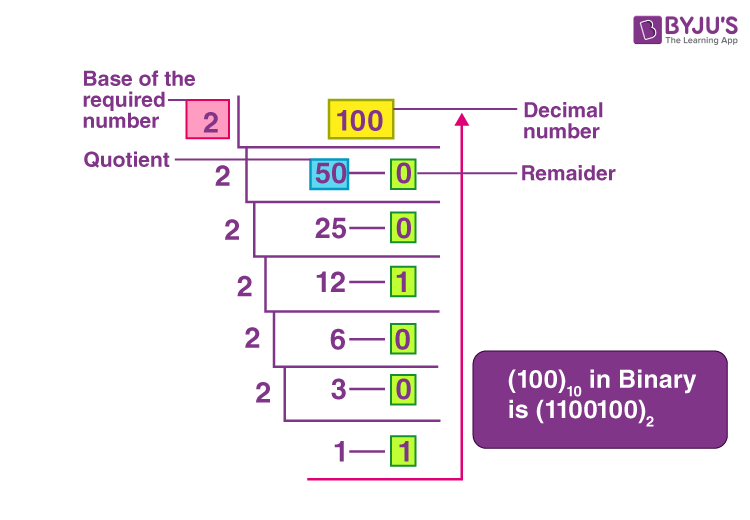

<body>
  <H1>Daily Learning</H1>
<div>
<h2>Basic</h2>
<p>
Day-1 (Date: 7-4-2023)
<h3>Why Binary not Decimal</h3>
<p>
  Computers use binary numbers instead of decimal numbers because binary is well-suited for electronic systems and digital processing. Here are a few reasons why binary is preferred over decimal in computer systems:

1. Simplicity of representation: Binary numbers consist of only two digits, 0 and 1, which aligns well with the on/off states of electronic switches (transistors). This simplicity makes it easier to design and implement digital circuits.

2. Hardware compatibility: The internal components of computers, such as logic gates and memory cells, are designed to work with binary signals. Using binary allows for direct compatibility and seamless integration with the underlying electronic hardware.

3. Reliability and noise resistance: Binary signals are more robust against noise and interference. The distinction between the binary digits 0 and 1 is easier to maintain in electronic circuits, reducing the chances of errors due to signal distortion.

4. Efficiency in storage: Binary numbers require fewer bits to represent the same value compared to decimal numbers. This efficiency in storage is crucial for memory and storage devices, as it allows for more information to be stored using the same amount of physical resources.

5. Logical operations: Binary numbers lend themselves well to logical operations like AND, OR, and NOT. These operations form the basis of computational operations in computers. Using binary simplifies the design and implementation of logical circuits and arithmetic units.

Although decimal numbers are more intuitive for human comprehension, they are not as efficient or compatible with the underlying electronic components and operations performed within computers. Binary numbers, while requiring a mental shift for human users, provide a highly efficient and reliable system for representing and manipulating information in computer systems.
</p>

  <h4>Number System</h4>
  <pre>
    1.Binary - Two base number.
    2.Octal - Eight base number.
    2.Decimal - Ten base number.
    2.Hexadecimal - Sixteen base number.
  </pre>
  <div>
    <h4>Binary to Decimal</h4>
    <pre>
      
      </br>
function convertToDecimal(x) {
    let bin = 0;
    let rem, i = 1, step = 1;
    while (x != 0) {
        rem = x % 10;
        x = parseInt(x / 10);
        bin = bin + rem * i;
        i = i * 2;
    }
console.log(`Decimal:  ${bin}`);
}
// take input
//let number = prompt('Enter a Binary number: ');
convertToDecimal(101);
    </pre>
    <h4>Decimal to Binary</h4>
    <pre>
      

</br>

Other way - decimal 75
75 >= 64 = 1
75 - 64 = 11

 32 >= 11 = 0
 16 >= 11 = 0

11 >= 8 = 1
11 - 8 = 3

3 >= 2 = 1
3 - 2 = 0

1 >= 1 = 1

64 = 1 
32 = 0 
16 = 0 
8 = 1 
4 = 0 
2 = 1 
1 = 1

75 = 1001011

function convertToBinary(x) {
    let bin = 0;
    let rem, i = 1, step = 1;
    while (x != 0) {
        rem = x % 2;
        console.log(
            `Step ${step++}: ${x}/2, Remainder = ${rem}, Quotient = ${parseInt(x/2)}`
        );
        x = parseInt(x / 2);
        bin = bin + rem * i;
        i = i * 10;
    }
    console.log(`Binary:  ${bin}`);
}
// take input
//let number = prompt('Enter a decimal number: ');
convertToBinary(5);
    </pre>
  </div>

  <h4>Decimal to Octal</h4>
  <pre>
    
    </br>
function convertToCOtalTOdecimal(x) {
    let bin = 0;
    let rem, i = 1, step = 1;
    while (x != 0) {
        rem = x % 8;
        x = parseInt(x / 8);
        bin = bin + rem * i;
        i = i * 10;    
    }
console.log(`Octal:  ${bin}`);
}
// take input
//let number = prompt('Enter a Decimal number: ');
convertToCOtalTOdecimal(8);

  </pre>
  <h4>Octal to Decimal</h4>
  <pre>
    
    </br>
function convertToDecimalTOOCatal(x) {
    let bin = 0;
    let rem, i = 1, step = 1;
    while (x != 0) {
        rem = x % 10;
        x = parseInt(x / 10);
        bin = bin + rem * i;
        i = i * 8;    
    }
    console.log(`Decimal:  ${bin}`);
}
// take input
//let number = prompt('Enter a Octal number: ');

convertToDecimalTOOCatal(100);
  </pre>
  
  <h4>DIFFERENT BETWEEM INTERPRETER AND COMPILAR</h4>
  A compiler translates the entire source code in a single run. 
  An interpreter translates the entire source code line by line

  <div>
  <h3>#KEYWORDS</h3>
    
    1. High level Language > INTERPRETER(Work line by line) > Machine Language
    2. Assembly language > Assembler > Machine Language
    3. Mid level language ( C )
    4. High level language(python, c++, c# etc)
    5. compiler(GNU, CSS) - A compiler translates the entire source code in a single run
    6. CodeBlocks(IDE-Integrated Development Environment)
    
  </div>
<div>
  <h1>Learn About Compiler and C/C++ </h1>
  <h4>Day-2 (Date: 7-6-2023)</h4>
  <p>Watch some videos read some documents about how compiler works</p>

  <a href="Book-Files/COMPUTER-PROGRAMMING-TAMIM-SHAHRIAR-SHUBEEN.pdf">Book(Bangla) - COMPUTER PROGRAMMING TAMIM SHAHRIAR SHUBEEN (Language C)</a> 
  </br>
  <a href="Book-Files/Programming in C - Stephen G.Cochan.pdf">Book(English) - PROGRAMMING IN C - STEPHEN G.COCHAN (Language C)</a>
  
  <h4>MEMORY</h4>
  <pre>
    Int (32bit) = {
      2 byte = 2 x 8 bit
             = 16 bit 
    }
    Int(64bit) = {
      4 byte = 4 x 8 bit
             = 32 bit 
    }
    32 bit maximum number = 2^n - 1
                          = 2^31 - 1
                          
  <h4>HOW TO STORE NEGATIVE NUMBER MEMORY</h4>
    #Sign bit
    0 -> Positive
    1 -> Negative
    MSB = Most Significant Bit
    LSB = Most Significant Bit
    
    In this case in magnitude area first number is MSB and last number is LSB.
    <h4>PROBLEM OF SIGN BIT</h4>
    0 0 0 0 !== 1 0 0 0
    +0 !== -0
    #SOLVE
    0011 = +3
    => 1100(flip of 0011) = 1's complement
    1's complement + 1
    1100 + 1 = 1101 = -2 (2's complement)
    0010 + 1 = +3 (2's complement) 
    #In this case computer can store 4bit.
    1111 + 1 = 10000 
    so, answer = 0000 = -0
    <h3>#KEYWORDS</h3>
    CodeBlocks,Environment setup,terminal,GCC,cmd 
  </pre>
</div>
<div>
  <h1>Bit Manupulaion</h1>
  <h4>Day-2 (Date: 7-5-2023)</h4>
  <pre>
    Bit manipulation is a technique used in computer programming to manipulate individual bits within a binary representation of data. It involves performing logical and arithmetic operations at the bit level, allowing developers to perform various tasks efficiently and compactly. Here are some commonly used bit manipulation operations:

1. Bitwise AND (&): Performs a logical AND operation on each corresponding pair of bits. 
The result is 1 if both bits are 1; otherwise, it is 0.

   Example:
    ```
   10101010 &
   11001100
   ---------
   10001000
   ```

3. Bitwise OR (|): Performs a logical OR operation on each corresponding pair of bits. 
The result is 1 if either of the bits is 1; otherwise, it is 0.

   Example:
   ```
   10101010 |
   11001100
   ---------
   11101110
   ```

4. Bitwise XOR (^): Performs a logical XOR (exclusive OR) operation on each corresponding pair of bits. 
The result is 1 if the bits are different; otherwise, it is 0.

   Example:
   ```
   10101010 ^
   11001100
   ---------
   01100110
   ```

5. Bitwise NOT (~): Flips the bits of a binary number. The result is the one's complement of the number.

   Example:
   ```
   ~10101010
   ---------
   01010101
   ```

6. Bitwise left shift (<<): Shifts the bits of a number to the left by a specified number of positions. 
This operation effectively multiplies the number by 2 raised to the power of the shift amount.

   Example:
   ```
   10101010 << 2
   -------------
   1010101000
   ```

7. Bitwise right shift (>>): Shifts the bits of a number to the right by a specified number of positions. 
This operation effectively divides the number by 2 raised to the power of the shift amount.

   Example:
   ```
   10101010 >> 2
   -------------
   00101010
   ```

Bit manipulation is often used in various applications, such as optimizing code, implementing data structures, 
and working with low-level operations like device drivers, network protocols, and cryptography algorithms. 
It allows for compact representation of data and efficient bitwise operations that can significantly improve 
performance in certain scenarios.
  </pre>
  <h3>Example of bit off or on test</h3>
  <pre>
    let x,y,z;
    x = parseInt(prompt("Inter number ", y));
    bit = parseInt(prompt("Inter bit number ", z));

  if(x & (1 << bit)){
    console.log(`${bit} nd bit is ON`);
  }else{
    console.log(`${bit} nd bit is OFF`);
  }
  </pre>

</div>

  
</p>
</div>
</body>
</html>
